## DC01 Setup

**Static IP Configuration** - Assigned 10.0.0.10 with subnet 255.255.255.0, gateway 10.0.0.1 (pfSense), DNS pointing to 127.0.0.1 (itself).
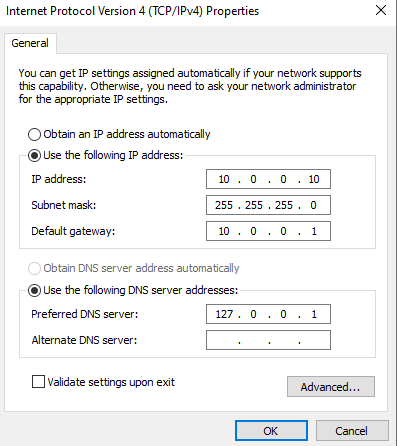

**Hostname** - Set to DC01.
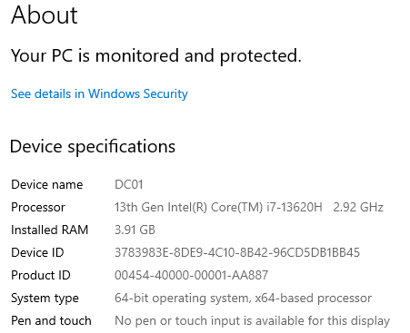

**AD DS Promotion** - Promoted to domain controller for lab.local. Server online at 10.0.0.10.
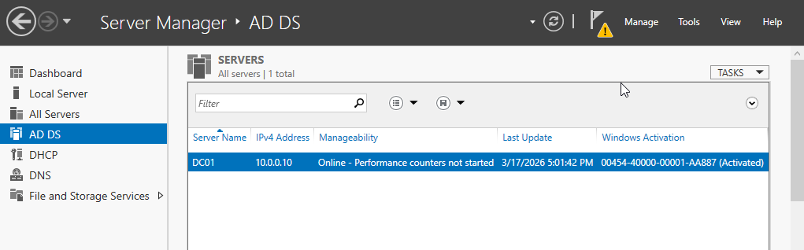

**DNS - Forward Lookup Zone** - lab.local and _msdcs.lab.local zones created automatically during AD promotion. Both Active Directory-Integrated.
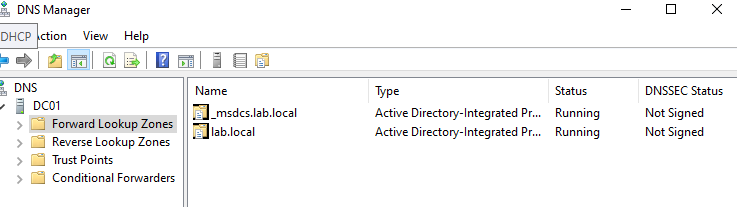

**DNS - Reverse Lookup Zone** - Created for 10.0.0.x network, enabling IP-to-hostname resolution.
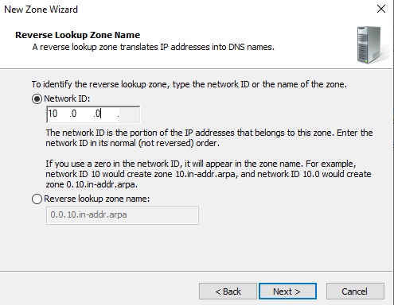

**DNS - Scavenging** - Enabled at 7-day intervals to automatically clean stale DNS records.
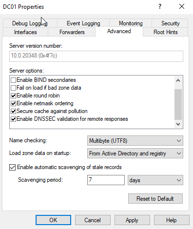

**DNS - Forwarders** - Configured external DNS forwarders (1.1.1.1, 8.8.8.8, 1.0.0.1, 8.8.4.4) for resolving external domains.
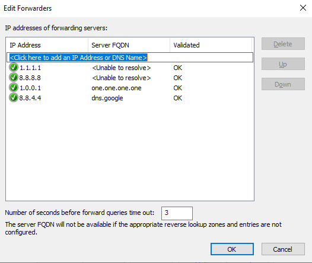

**DHCP - Authorization Error (Troubleshooting)** - DHCP authorization failed with Error 20070 because VirtualBox's default "vboxuser" account lacked domain admin permissions. Resolved by logging in as LAB\Administrator and re-authorizing.
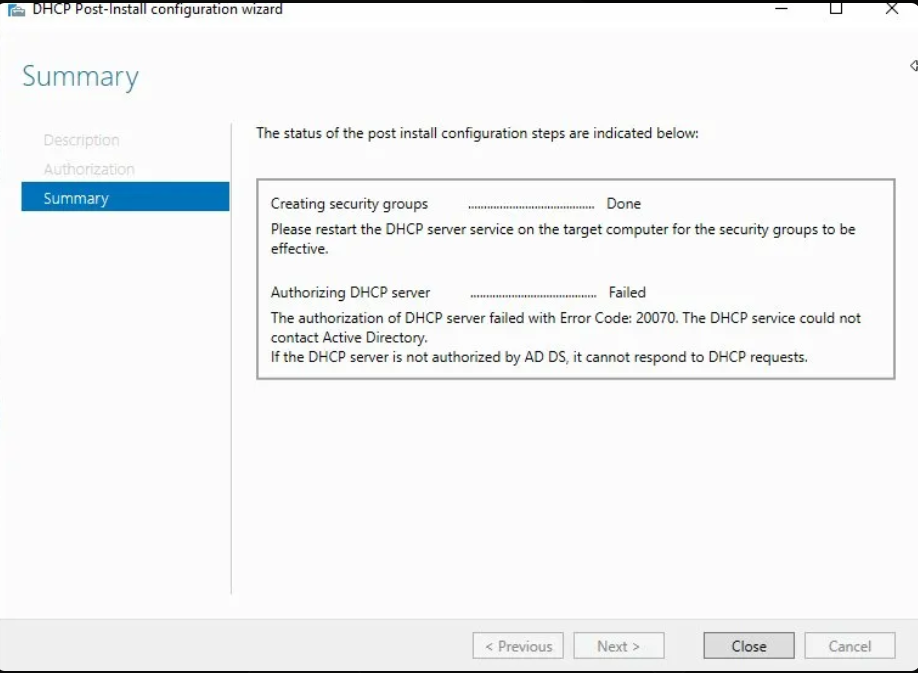
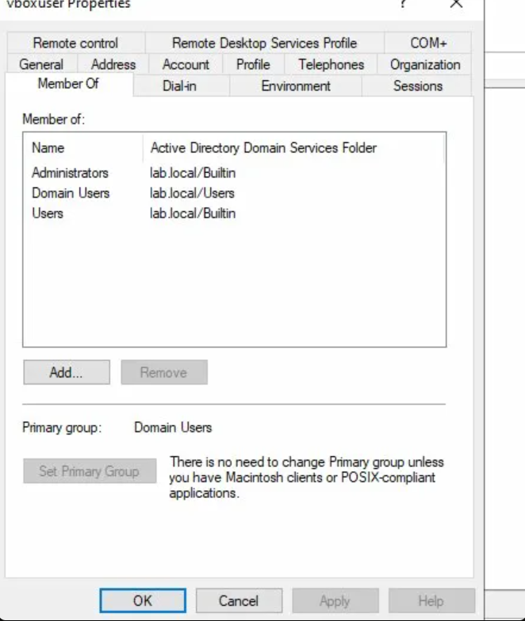

**DHCP - Scope Configuration** - Created scope 10.0.0.100–200 with /24 subnet mask, 8-hour lease, gateway 10.0.0.1, DNS 10.0.0.10.
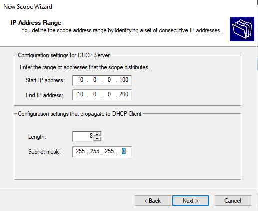

## DHCP Scope Options

**Gateway (Router)** - Set default gateway to 10.0.0.1 (pfSense) so clients know where to send traffic leaving the local network.
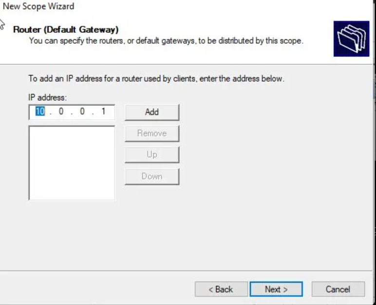

**DNS Server** - Pointed clients to 10.0.0.10 (DC01) for all name resolution. DC01 handles internal lookups and forwards external queries.
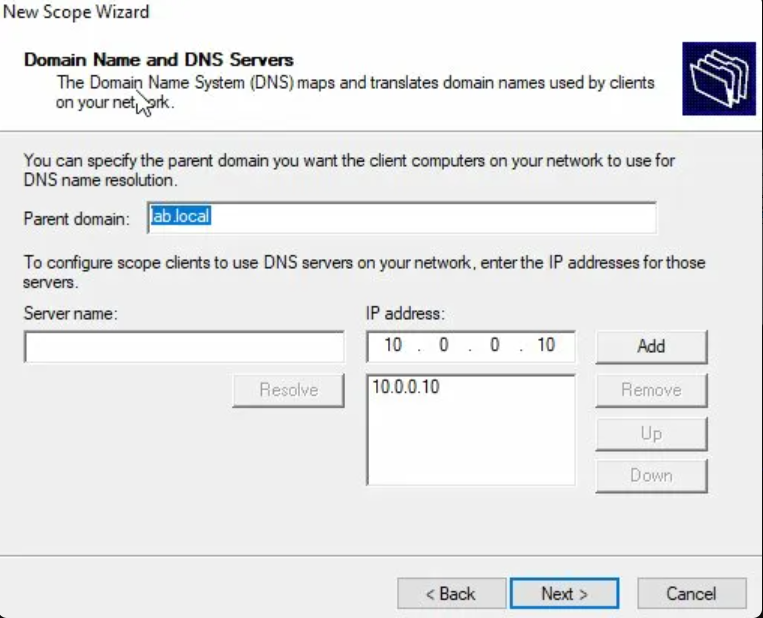

## DC02 - Secondary Domain Controller

**Static IP** - Assigned 10.0.0.11. DNS points to 10.0.0.10 (DC01) so DC02 can locate the existing domain during promotion.
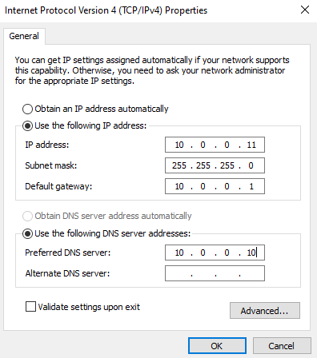

**Domain Join** - Joined DC02 to lab.local before promoting to domain controller.
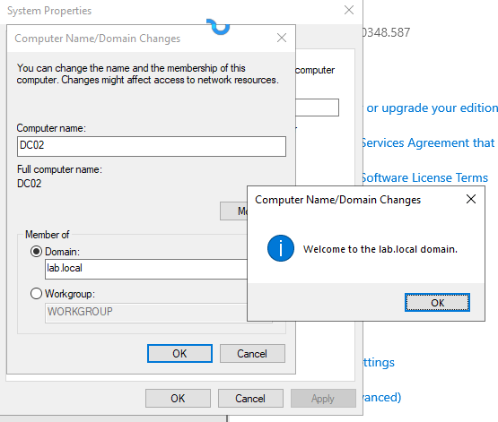

**Replication Verification** - Ran `repadmin /showrepl` on DC02. All five naming contexts (domain, configuration, schema, DomainDnsZones, ForestDnsZones) replicated successfully from DC01 with zero failures.
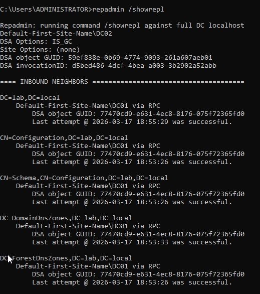

## OU Structure

**Organizational Units** - Built enterprise-style OU hierarchy. Departments separated by function, Workstations split by device type, dedicated OUs for Security Groups, Servers, Service Accounts, Disabled Accounts, and Staging for new hires.
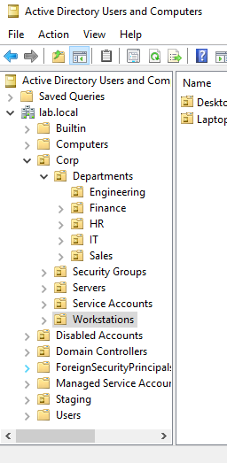

## User Management

**Manual Creation** - Created first user account manually through AD Users and Computers to understand the process.
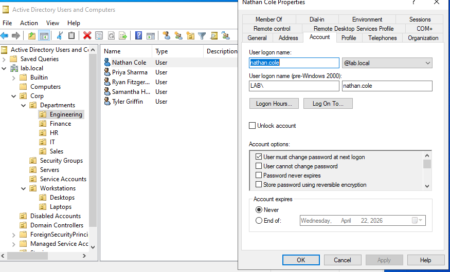

**Bulk Creation via PowerShell** - Deployed 25 users across all departments using a CSV import script. Username format: firstname.lastname. All accounts set with ChangePasswordAtLogon enabled.
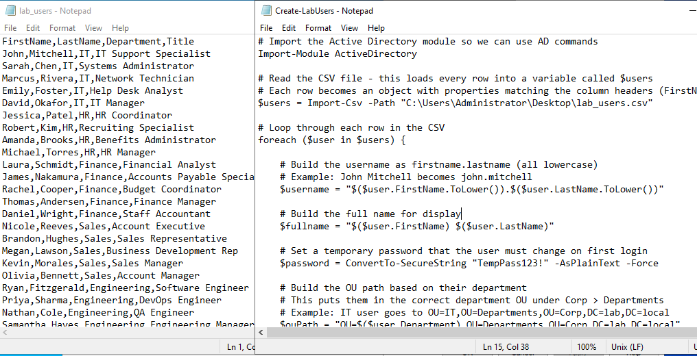

## DNS Failover Fix (Self-Identified)

**Problem:** DHCP scope only had DC01 (10.0.0.10) as the DNS server. If DC01 went down, all clients would lose DNS resolution even though DC02 had a full copy of all DNS zones.

**Fix:** Added DC02 (10.0.0.11) as secondary DNS server in DHCP scope options. Clients now fail over automatically.
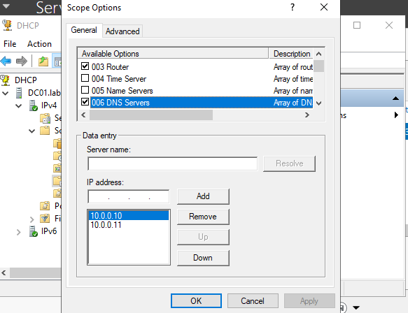

## Security Groups (RBAC)

**Department Groups** - Created SG-IT, SG-HR, SG-Finance, SG-Sales, SG-Engineering as Global Security groups. Members added based on OU location.
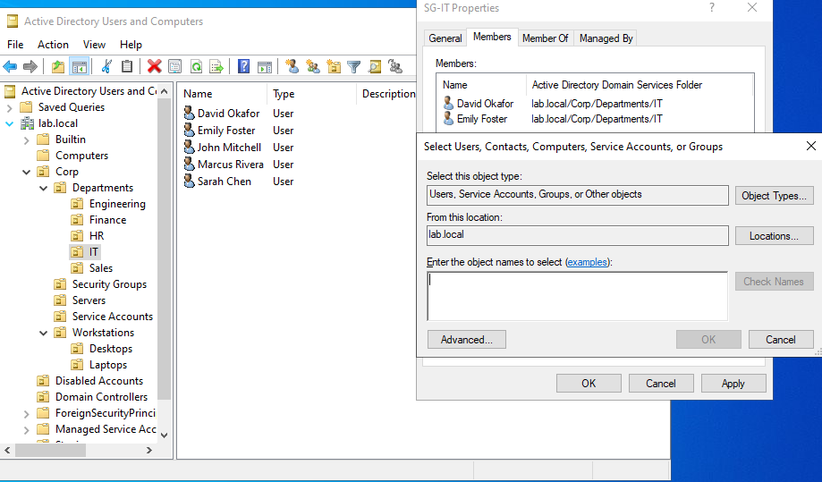
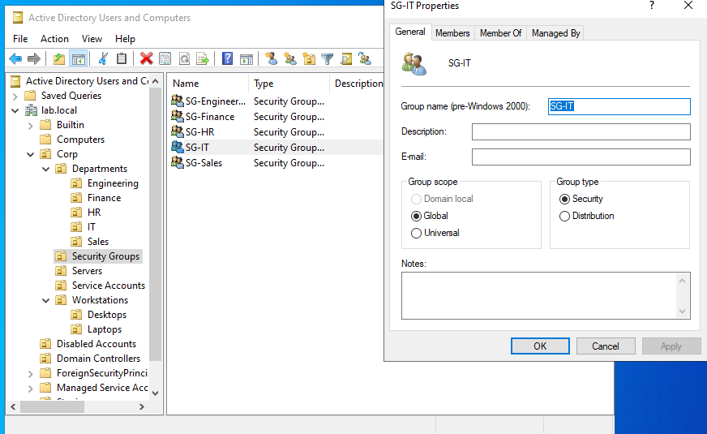

**Role-Based Groups** - Created SG-VPN-Users, SG-Remote-Desktop-Users, SG-Finance-Share-ReadWrite. These cut across departments - not everyone needs VPN or file share write access regardless of department.
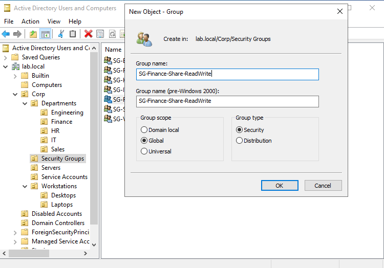

**Completed Security Groups** - All 8 security groups in place. Permissions are always assigned to groups, never individual users.
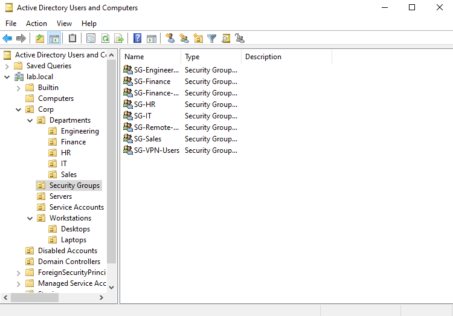

## Group Policy Objects

**Password Policy** - Linked to domain (lab.local). Enforces 12-character minimum, complexity enabled, 90-day max age, 30-day min age, lockout after 5 failed attempts with 30-minute duration. Applied domain-wide so all users, servers, and service accounts are covered.
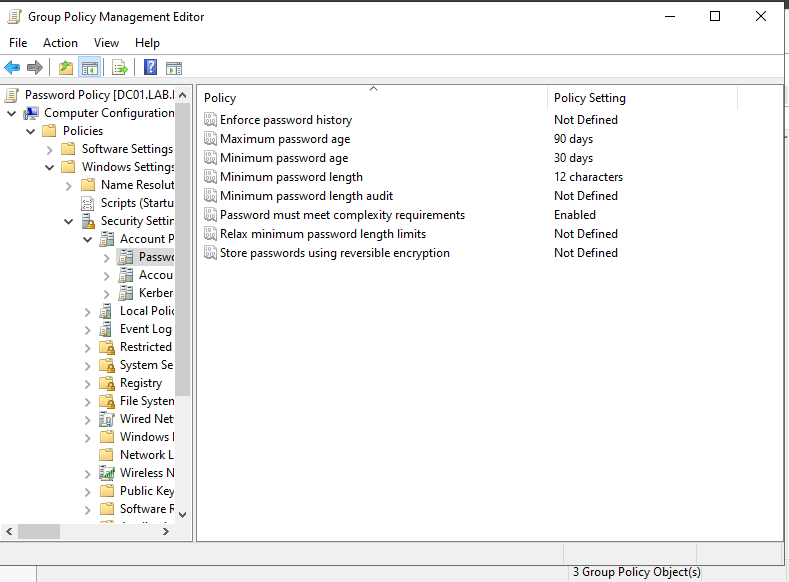
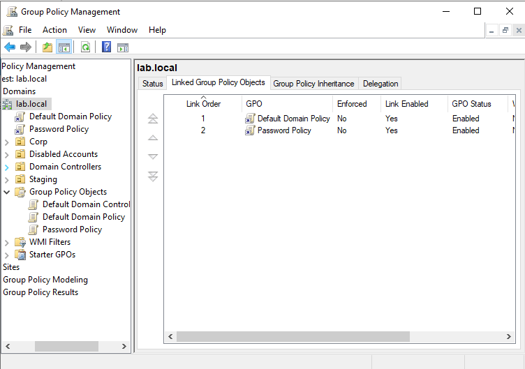

**Workstation Security** - Linked to Workstations OU. Windows Firewall enforced on (all profiles), RDP enabled, automatic updates set to auto-download and install at 3:00 AM, sleep timeout 600 seconds.
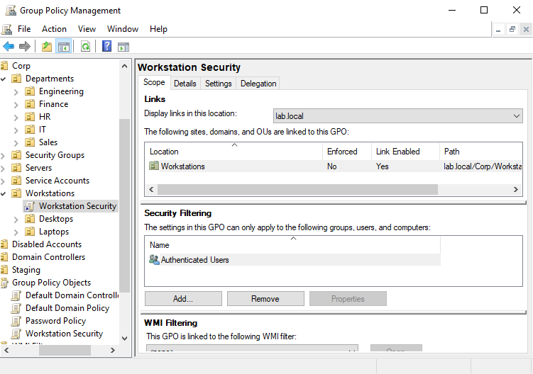

**Drive Mapping** - Linked to Departments OU. Maps department shares (e.g., \\SRV-FILE\Finance as F: drive) using item-level targeting by security group. Only members of SG-Finance get the Finance drive, only SG-Sales gets the Sales drive, etc. One GPO handles all departments instead of creating separate policies per department.
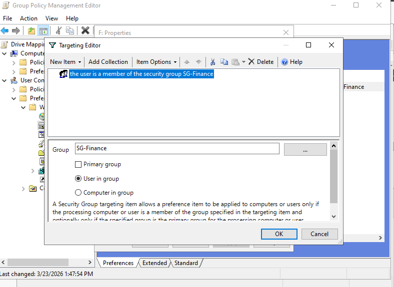

**USB Restriction** - Linked to Engineering, Finance, HR, and IT OUs. Denies all removable storage access. Sales excluded due to lower data sensitivity - their customer data lives in cloud CRMs rather than local files.

**Full GPO Layout** - Password Policy at domain level, Drive Mapping at Departments, USB Restriction on high-risk department OUs, Workstation Security on Workstations OU.
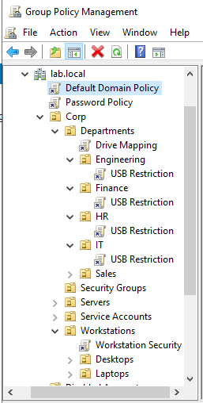