# Breakage Exercises — Phase 1

## Exercise 1: Changed DC01's IP Without Updating DNS

**What I Broke:** Changed DC01's static IP from 10.0.0.10 to 10.0.0.15 without updating any dependent services.
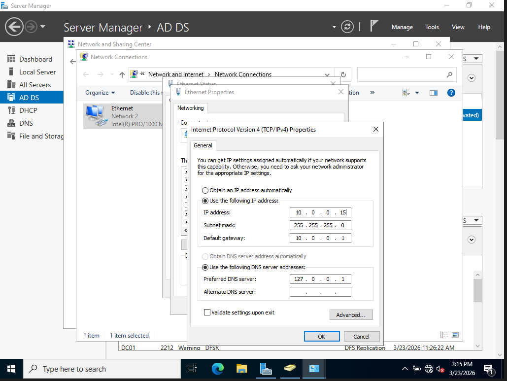

**Symptoms:**
- DNS auto-registered the new IP but left a stale 10.0.0.10 record, creating duplicate A records in the forward lookup zone
- nslookup resolved to the new IP but showed "Server: Unknown" indicating reverse DNS wasn't clean
- DHCP scope options still pointed clients to 10.0.0.10 for DNS
- DC02 couldn't replicate — Event Viewer showed DFS Replication errors, DNS Server warnings, and AD Domain Services failures

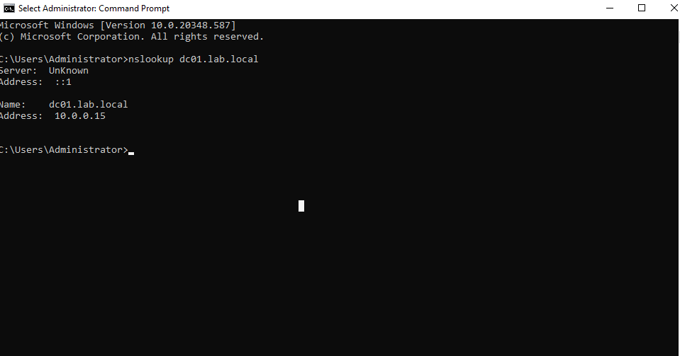
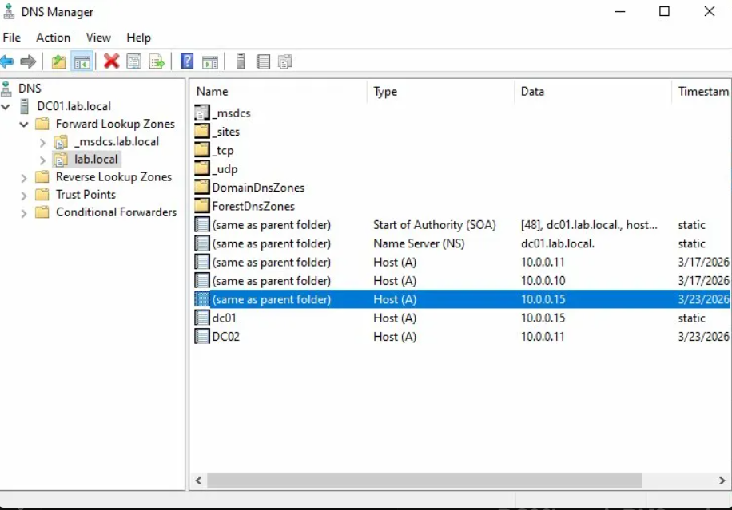
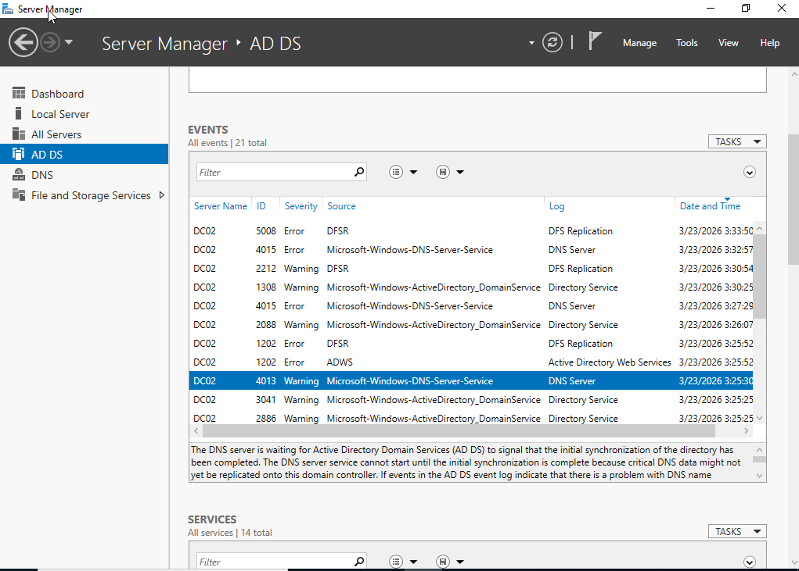

**Resolution:** Reverted DC01 back to 10.0.0.10 — one change vs updating every downstream dependency. Deleted the stale 10.0.0.15 A record from DNS. However, replication damage persisted and wasn't fully discovered until Exercise 7 (see below).

**Key Takeaway:** A domain controller's IP is referenced everywhere — DHCP scope options, client configs, other DCs' static settings, DNS records, replication topology. Changing it without updating every dependency cascades failures across the entire domain.

---

## Exercise 2: Disabled a User Account

First, I created the client vm PC-WS01 and logged in as john.mitchell and verified their network settings were correctly configured from DC01's DHCP server, then I joined the lab.local domain.

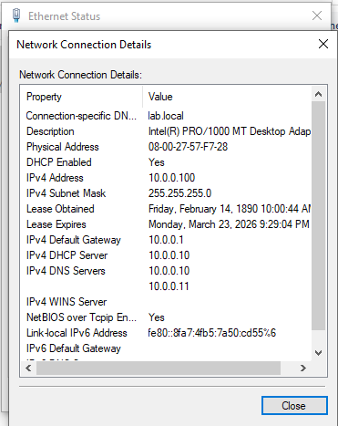
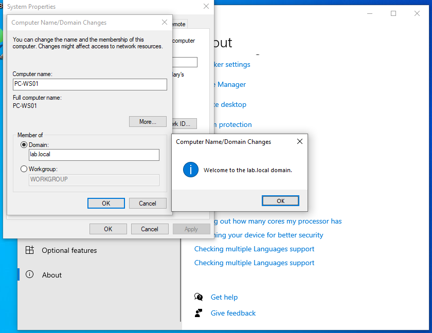

**What I Broke:** Disabled john.mitchell's account in AD Users and Computers.
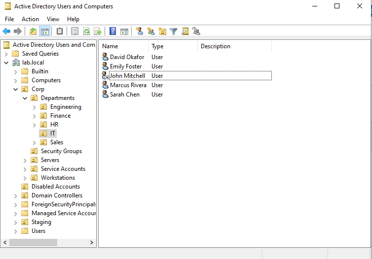

**Symptoms:** After signing out and attempting to log back in on WS-PC01, received the error "Your account has been disabled. Please see your system administrator."
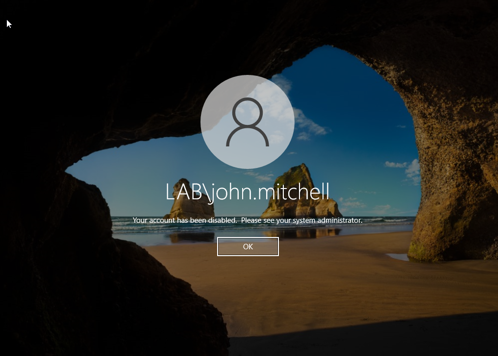

**Note:** The existing logged-in session continued working because Windows caches credentials locally. The block only appeared after a full sign-out and fresh login attempt.

**Diagnosis:** Ran `Get-ADUser "john.mitchell" -Properties Enabled` on DC01. Output confirmed `Enabled : False`.
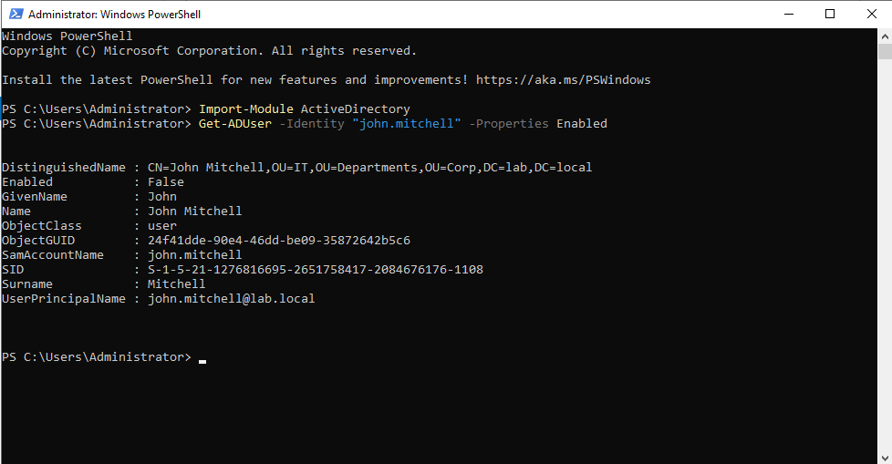

**Resolution:** Re-enabled the account with `Enable-ADAccount -Identity "john.mitchell"`. Verified with Get-ADUser showing `Enabled : True`.
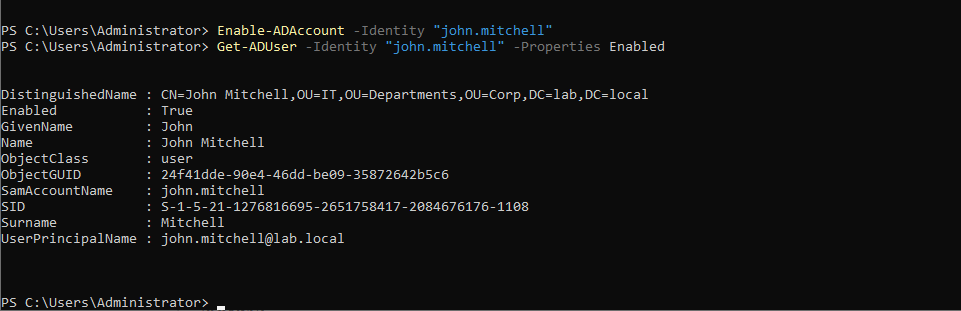

**Key Takeaway:** Disabled vs locked accounts produce different error messages. On the job, users just say "I can't log in" for both — the diagnostic commands tell you which one it actually is.

---

## Exercise 3: Account Lockout (5 Failed Passwords)

**What I Broke:** Entered the wrong password 5 times on WS-PC01 to trigger the lockout policy.

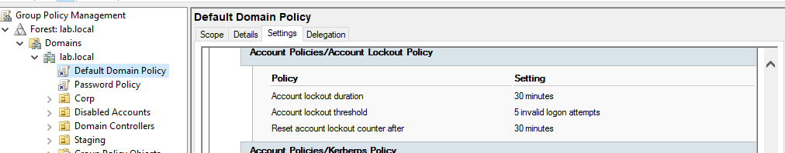

**Symptoms:** After the 5th failed attempt, received "The referenced account is currently locked out and may not be logged on to." — a different message than the disabled account error.

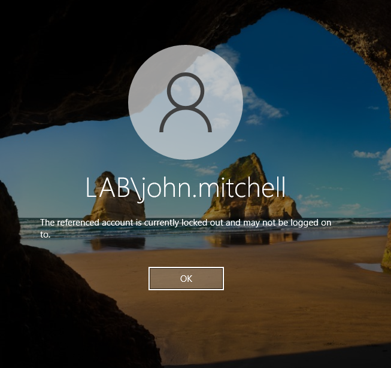

**Important Discovery:** The lockout policy initially didn't work from my custom Password Policy GPO. Account lockout and password policies only apply from the Default Domain Policy in Active Directory — this is a specific AD requirement that doesn't apply to other GPO settings. Had to configure the lockout threshold in the Default Domain Policy instead.

**Diagnosis:** Ran `Search-ADAccount -LockedOut` on DC01 to find all locked accounts in the domain.

**Resolution:** Unlocked with `Unlock-ADAccount -Identity "john.mitchell"`.

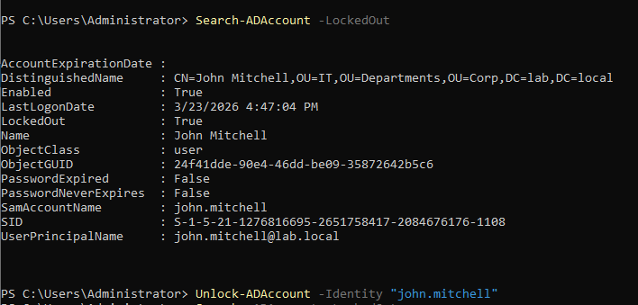

**Key Takeaway:** Password and account lockout policies are a special case in AD — they must be in the Default Domain Policy to apply to domain accounts. Other GPO settings (firewall, drive mapping, USB restriction) work fine from custom GPOs.

---

## Exercise 4: Moved User to Wrong OU

**What I Broke:** Moved john.mitchell from the IT OU to the Sales OU.

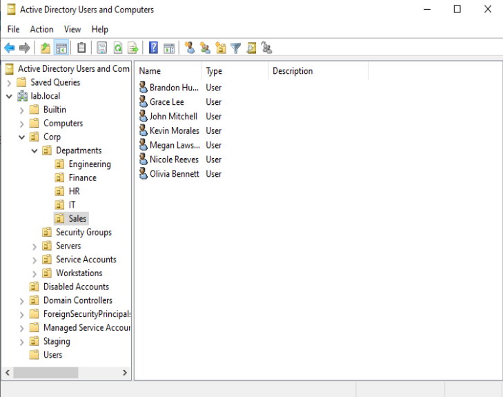

**Symptoms:** After running `gpresult /r` on WS-PC01, the USB Restriction GPO no longer applied — Sales is the only department without that policy. However, `whoami /groups` still showed SG-IT membership because OU placement and security group membership are independent.

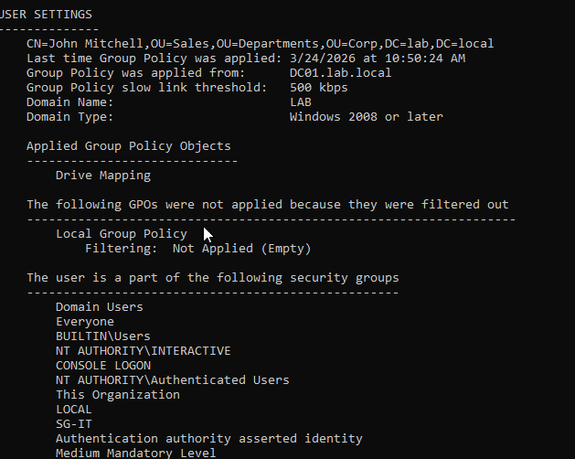

**Security Implication:** This created a gap — john.mitchell had IT-level resource access (via SG-IT) plus no USB restriction (via Sales OU). In a real scenario, someone could access sensitive IT resources and copy them to a removable drive. This is why department transfers require updating both the OU and security group membership together.

**Resolution:** Moved john.mitchell back to the IT OU.

**Key Takeaway:** OUs control which GPOs apply. Security groups control which resources are accessible. Moving someone between OUs without updating their groups creates security gaps. Proper department transfer procedures must address both.

---

## Exercise 6: Removed User from Security Group

**What I Broke:** Removed john.mitchell from SG-IT.

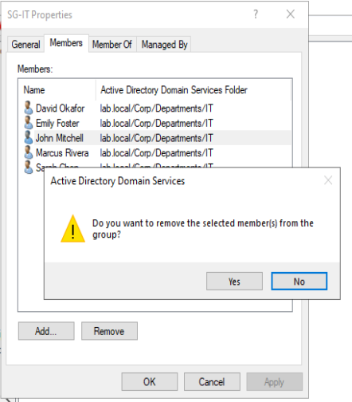

**Symptoms:** After `gpupdate /force` and a sign-out/sign-in, `whoami /groups` confirmed SG-IT was no longer listed. In a full environment this would mean losing access to IT file shares, drive mappings targeted to SG-IT, and any other resources where SG-IT is granted permissions.

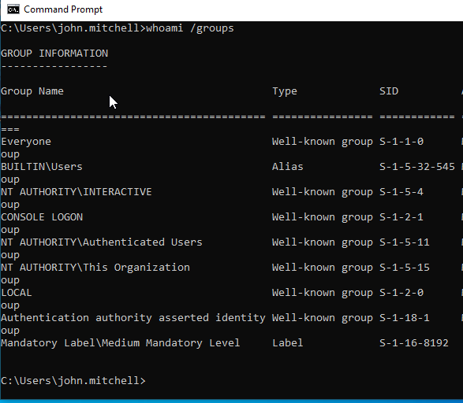

**Resolution:** Re-added with `Add-ADGroupMember -Identity "SG-IT" -Members "john.mitchell"`.

**Key Takeaway:** One group membership change instantly revokes all associated permissions. This is the power of RBAC — and why accidental group removal is a common help desk ticket ("I suddenly can't access the shared drive").

---

## Exercise 7: DC01 Shutdown — Failover Test

**What I Broke:** Shut down DC01 completely to test whether DC02 could handle domain operations alone.

**Initial Failure — Replication Damage from Exercise 1:**
The failover initially failed. WS-PC01 couldn't authenticate against DC02 — first the password was rejected (DC02 still had the old password), and then it showed "The security database on the server does not have a computer account for this workstation trust relationship" (DC02 didn't know about WS-PC01 at all).

Investigation revealed that replication had been broken since Exercise 1's IP change. Running `repadmin /replsummary` on DC02 showed 100% failure rate with "RPC server unavailable" and "DNS lookup failure" errors. Last successful replication was 3/23 at 15:49 — right around when the IP change exercise happened.

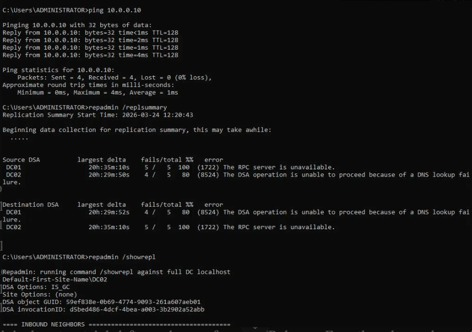

**Fixing Replication:**
1. Booted DC01 back up
2. Ran `ipconfig /registerdns` on DC01 to force correct DNS registration
3. Ran `repadmin /syncall /AeD` on DC01 to force replication
4. Ran `ipconfig /flushdns` on DC02 to clear stale DNS cache
5. Ran `repadmin /syncall /AeD` on DC02
6. Verified `repadmin /replsummary` showed 0 failures on both DCs

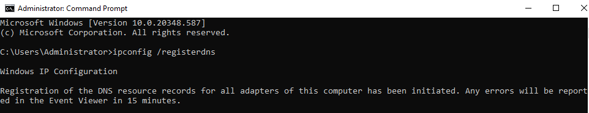
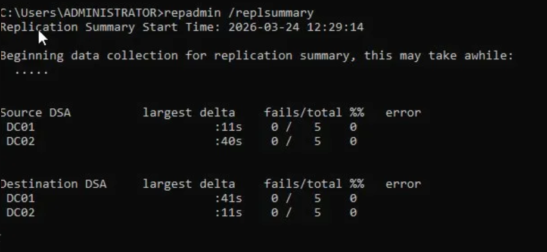

**Successful Failover:**
After fixing replication and syncing, shut DC01 down again. This time john.mitchell logged into WS-PC01 successfully. Ran `nltest /dsgetdc:lab.local` which confirmed the workstation was authenticated against DC02.lab.local at 10.0.0.11.

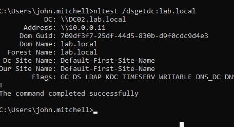

**Key Takeaway:** Failover only works if replication is healthy. A "fixed" issue can leave hidden damage that doesn't surface until something else depends on it. Always verify replication after any DC changes with `repadmin /replsummary`. Also — this exercise proved the value of adding DC02's IP (10.0.0.11) as a secondary DNS server in DHCP scope options, which was a gap I identified and fixed earlier.

## Exercise 8: NET-001 — Wrong DNS on Client (Ticket Simulation)

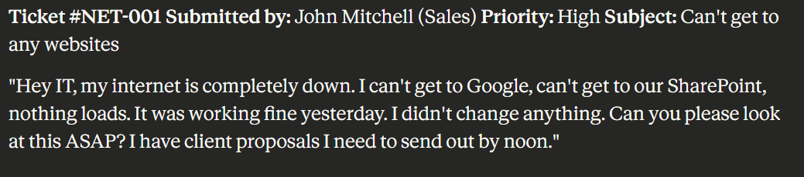
Diagnosis: ipconfig /all showed DNS server set to static 10.0.0.30 instead of DHCP-assigned 10.0.0.10. IP, gateway, DHCP lease all correct.
Root cause: Wrong DNS means names can't resolve, but network connectivity is intact. ping 8.8.8.8 would succeed, ping google.com would fail. Classic "can ping by IP, can't browse" pattern.
Fix: Switched adapter back to DHCP, ipconfig /flushdns, ipconfig /release and /renew. Connection restored.
Ticket closure:

User reported workstation internet down. ipconfig /all showed static DNS 10.0.0.30 instead of DHCP-assigned 10.0.0.10. Switched to DHCP, flushed DNS cache, release/renew. Resolved. Static DNS origin unknown — flagged for follow-up.