# Phase 5: Exchange Online Administration - Build Log

Exchange Online is the single largest ticket category in desktop support. This phase covers shared mailboxes, distribution lists, mail flow rules, message trace, calendar delegation, and Outlook client troubleshooting - including discovering that traditional troubleshooting steps don't apply on modern Intune-managed devices.

---

## Shared Mailbox - helpdesk@MeridianLabSolutions.onmicrosoft.com

Created a shared mailbox for the IT help desk team. Granted Full Access and Send As permissions to IT department users.

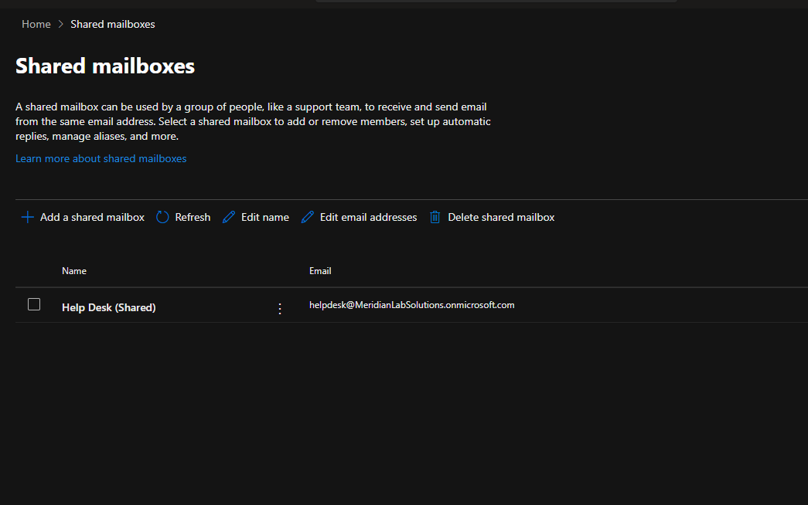

**Design consideration:**  Initially wanted to assign permissions to a security group (SG-Helpdesk) rather than individual users - that way new help desk techs automatically get access by being added to the group in AD. Created SG-Helpdesk in on-prem AD , synced to Entra ID, but the Exchange Admin Center GUI only allows adding individual users to shared mailbox permissions, not groups. Ended up assigning users individually through the GUI for the lab.

In production, PowerShell would handle group-based assignment (`Add-MailboxPermission` with the group name), but for a small help desk team, individual assignment through the GUI works fine and is more common at the desktop support level.

**Shared mailbox auto-mapping:** After granting Full Access, the shared mailbox didn't appear in Outlook immediately. Exchange permissions take up to 60 minutes to auto-map. The workaround is having the user manually add it: right-click mailbox name → Add shared folder → type the shared mailbox address. This is one of the most common "it's not working" calls that's actually just propagation delay.

**Send As vs Send on Behalf:**
- **Send As** - email appears to come directly from helpdesk@ with no indication of who actually sent it. Used when the individual sender doesn't matter, like help desk ticket responses.
- **Send on Behalf** - email shows "John Mitchell on behalf of Help Desk." Used when transparency matters, like an assistant sending on behalf of an executive.

Tested both by sending emails from the shared mailbox and verifying how they appeared to recipients.

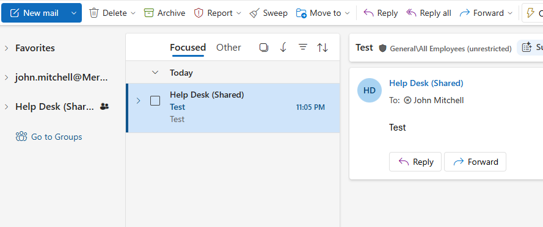

---

## Distribution Lists

### Dynamic Distribution - DL-All-Staff

Created as a dynamic distribution list that automatically includes all users with Exchange mailboxes. Membership updates automatically - no manual management when employees join or leave. Restricted sending permissions so only designated users (HR/leadership) can send to it, preventing reply-all storms from every employee.

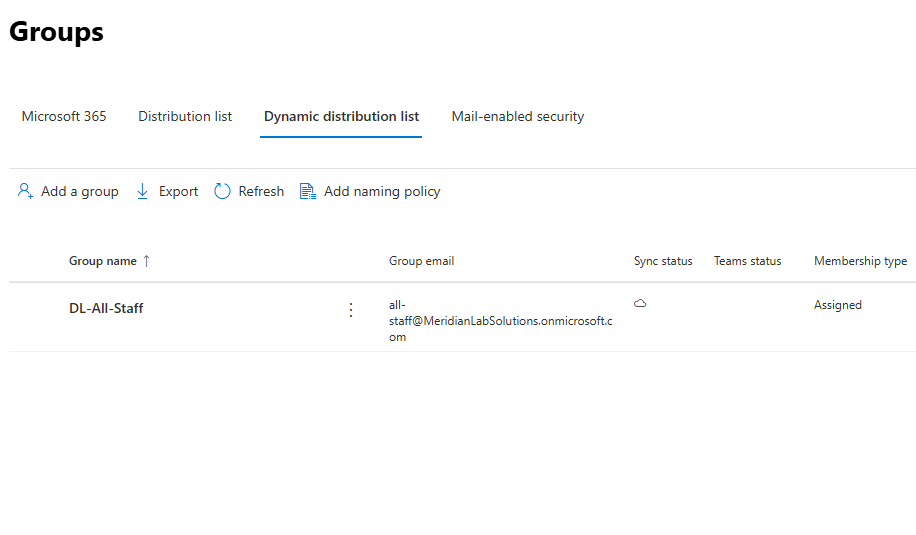

### Department Distribution Lists

Created static distribution lists for each department: DL-Sales, DL-Engineering, DL-HR, DL-Finance, DL-IT. Added appropriate members manually.

**Why distribution lists instead of M365 Groups:** Distribution lists are purely for email routing - send to one address, everyone in the list gets a copy. No shared mailbox, no SharePoint site, no calendar. M365 Groups bundle all of that together, which is overkill when all you need is "email this address and five people get it." Different tools for different purposes.

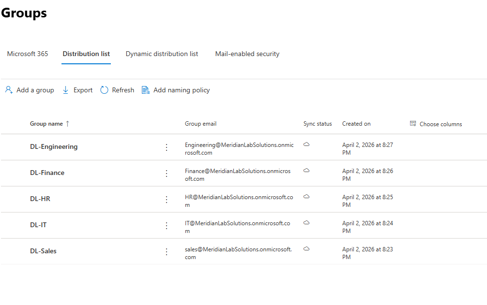

**Understanding the group types:**
- **Distribution list** - email routing only, no access control capability
- **Security group** - access control only (file shares, SharePoint, licensing), no email
- **Mail-enabled security group** - does both: receives email AND controls access to resources
- **M365 Group** - collaboration bundle: shared mailbox + SharePoint site + Teams team + calendar
- **Dynamic distribution** - membership auto-populates based on user attributes (department, location, etc.)

---

## Mail Flow Rules

### External Email Tagging

Created a transport rule that prepends `[External]` to the subject line of all inbound email from outside the organization. This is one of the most common security configurations in production - helps users immediately identify external senders as a basic phishing defense.

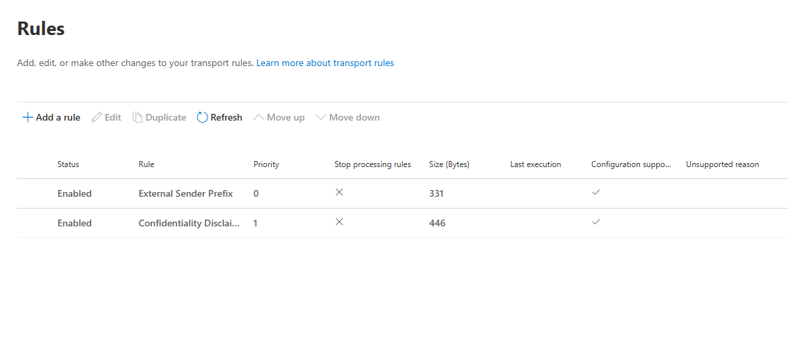

### Confidentiality Disclaimer

Created a rule appending a confidentiality disclaimer to all outbound email to external recipients. Used HTML formatting for proper presentation (line breaks, gray italic text, horizontal rule separator).

**Testing observation:** Initial formatting was rough - no whitespace before the disclaimer and the [External] tag had no space after the bracket, joining it to the subject. Fixed by editing the rules: added a trailing space to the external tag and used HTML in the disclaimer body.

### Message Trace

Traced test emails through Exchange Admin Center → Mail Flow → Message Trace. Verified both mail flow rules firing in the trace details - could see exactly which rules were applied during transport.

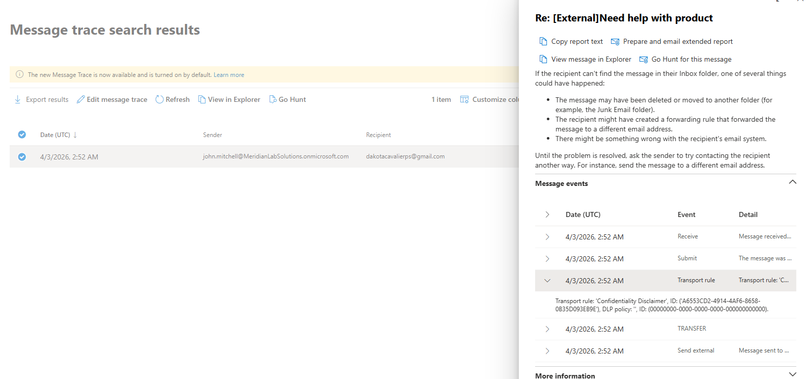

**Time zone note:** Exchange Online logs everything in UTC. Pennsylvania (EDT) is UTC-4, so a 10:52 PM local email shows as 2:52 AM UTC the next day in the trace. Important to know when correlating user-reported times with trace timestamps.

Tested a failure scenario by creating a rule that blocks all outbound external email. Message trace clearly showed the blocking rule and the specific rejection reason. Deleted the rule after testing.

Also discovered Defender integration - can view full email message content, headers, and threat detections directly from the trace. That's where you'd go if a user reports a suspicious email and you need to investigate before escalating to security.

---

## Calendar Delegation

Configured calendar delegation between two users - one as the executive, one as the assistant with Editor (Can Edit) permissions. Set up through OWA: Calendar → Sharing and permissions → Add user → set permission level.

Editor permissions allow the delegate to view the calendar and create/modify meetings on behalf of the executive. Tested by logging in as the delegate and adding calendar entries.

For the breakage exercise, removed the delegate's access and verified they could no longer see or edit the calendar.

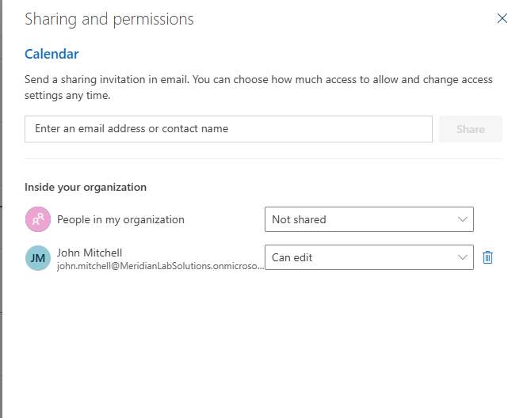


---

## Outlook Client Troubleshooting - Modern vs Traditional

This was the most valuable learning in the entire Exchange phase. Attempted to follow a standard Outlook troubleshooting runbook on an Intune-managed, Entra-joined device running New Outlook and discovered that most traditional steps don't apply.

### What the Traditional Runbook Says vs What Actually Works

| Traditional Step | Modern Equivalent | Why It's Different |
|---|---|---|
| Clear Credential Manager | Revoke sessions in Entra admin center | Auth is handled through WAM and the PRT on Entra-joined devices, not cached credentials in Credential Manager |
| Rebuild .OST file | Not applicable | New Outlook doesn't use .OST files - it's essentially a web app wrapper with no local cache file |
| Repair Outlook profile | Settings → Apps → Installed Apps → Outlook → Repair | No "Mail" applet in Control Panel, no profile management on New Outlook |
| Create new Outlook profile | Settings → Apps → Installed Apps → Outlook → Reset | No profile concept in New Outlook; Reset wipes local state and forces fresh setup |
| Toggle Work Offline | Not commonly applicable | New Outlook doesn't have the traditional Send/Receive ribbon |

### Password Change Token Persistence

Changed a test user's password and revoked their sessions from the admin center. OWA immediately required re-authentication (session killed). But desktop Outlook on the Intune-managed device kept working for 10+ minutes because the device-level PRT (Primary Refresh Token) was still valid.

The PRT is tied to the device's Entra ID registration, not just the user's session. Revoking sessions kills cloud tokens but the device-level PRT persists until something forces it to re-evaluate - closing and reopening the app, locking/unlocking the workstation, or rebooting.

**Practical takeaway:** On managed devices, "close and reopen Outlook" after a password reset isn't generic helpdesk advice - it's forcing the app to request a new token, which is when it discovers the old credentials don't work. Most techs don't understand why this works; now I do.

### Intune Policy Removal Gotcha

Applied a device configuration profile blocking access to Control Panel. Later deleted the policy from Intune, but the restriction persisted on the device. Policy deletion doesn't automatically undo what was applied - the device needs to sync and reprocess. Fixed by forcing a sync through Settings → Accounts → Access work or school → Sync.

### The Realistic Troubleshooting Path for Modern Managed Devices

```
1. Check OWA (outlook.office.com) - isolate client vs server issue
2. If OWA works but desktop doesn't:
   a. Close and reopen Outlook (forces token re-evaluation)
   b. Reboot the device (refreshes PRT)
   c. Revoke user sessions from admin center
   d. Repair the app (Settings → Apps → Installed Apps → Outlook → Repair)
   e. Reset the app (nuclear option - wipes local state)
   f. Escalate to Intune team if device needs reprovisioning
3. If OWA is also broken - server-side issue:
   a. Check licensing (M365 admin center)
   b. Check mailbox provisioning (Exchange admin center)
   c. Check account status - locked? disabled? MFA broken?
   d. Check mail forwarding rules (compromised account indicator)
   e. Check mail flow rules + message trace
```

---

## MFA Break/Fix

Deleted a test user's Microsoft Authenticator registration to simulate the "lost phone" scenario. With a Conditional Access policy requiring MFA, the user hit a wall - no valid MFA method registered, can't get past the login screen.

**Recovery options:**
- **Require re-register MFA** - forces the user to set up a new authenticator on next login. Works if they can get past the initial auth screen.
- **Temporary Access Pass (TAP)** - time-limited one-time passcode issued from Entra ID that lets the user sign in without MFA, then register a new authenticator during that session. Used when the user can't even reach the MFA registration prompt.

This is one of the most common help desk tickets: "I got a new phone and can't log in anymore."

---

## Exchange Breakage Exercises

### License Removal via Group

Removed a user from SG-M365-E5-License in on-prem AD and forced a delta sync. User immediately lost access to Outlook - OWA showed no mailbox or license assignment. Re-added to the group in AD, synced, and the mailbox recovered with all data intact (Exchange retains the mailbox in soft-delete for 30 days).

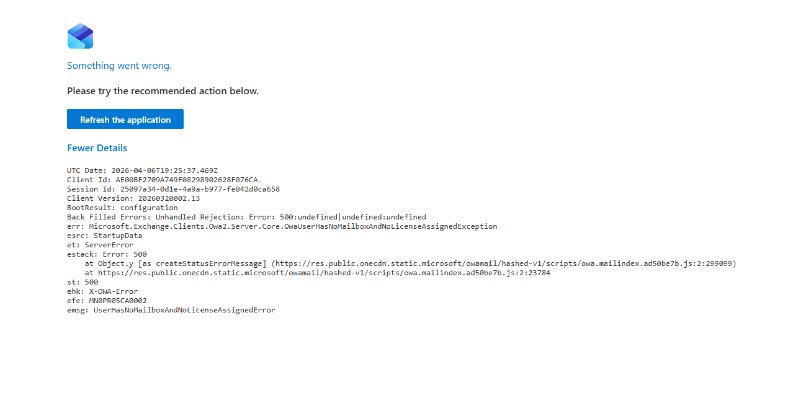

**Note:** During recovery, the M365 admin center was experiencing a service disruption. Checked Service Health dashboard to confirm it was Microsoft-side, not a configuration issue. The fix (re-adding to the group in AD) worked even though the admin center GUI was degraded - the sync pipeline operates independently. This is the resilience of the hybrid model.

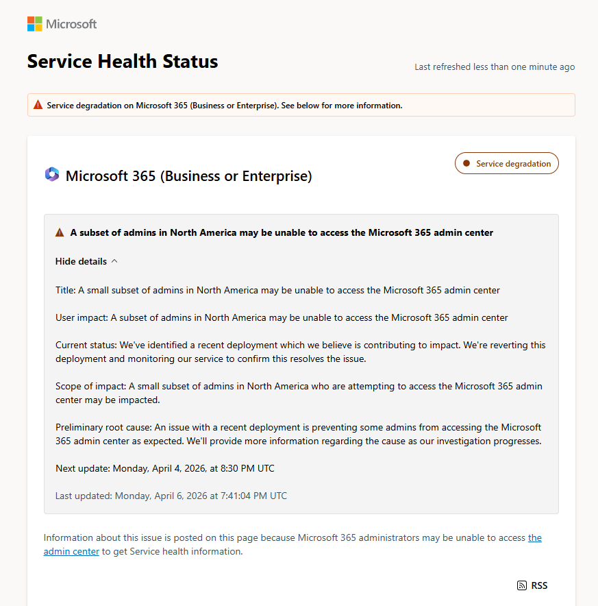

### Mail Flow Rule Blocking External Email

Created a transport rule blocking all outbound external email. Internal email still worked. Message trace clearly identified the blocking rule as the cause. This simulates a misconfigured transport rule in production - help desk gets flooded with "I can't send email" tickets, and the person who checks message trace and identifies the rule within 2 minutes is the hero.

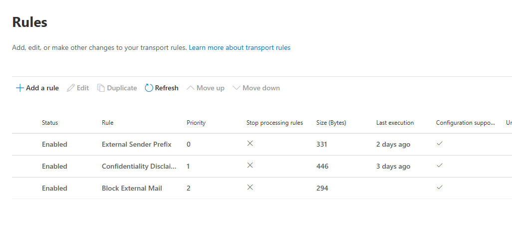

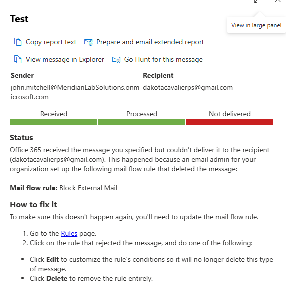

### Send As Without Full Access

Tested granting Send As permission without Full Access. User could compose and send from the shared mailbox but couldn't see its inbox. These are independent permissions - Send As controls outgoing, Full Access controls reading. Both are needed for full shared mailbox functionality.