# Phase 4: Hybrid Identity with Entra Connect - Build Log

This documents the connection of on-prem Active Directory to a Microsoft 365 E5 tenant via Entra Connect. Users are created and managed in on-prem AD, synced to Entra ID, and automatically licensed through group-based licensing. The entire onboarding pipeline - from AD account creation to a working mailbox - flows without touching the cloud.

---

## Tenant Cleanup

Wiped the existing M365 tenant - deleted all manually created users, groups, and Conditional Access policies. Started with a clean slate so the tenant reflects only what syncs from on-prem AD. This prevents soft-match conflicts and duplicate objects during the initial Entra Connect sync.

---

## On-Prem AD Preparation

### UPN Suffix

Added  `MeridianLabSolutions.onmicrosoft.com` as an alternative UPN suffix in Active Directory Domains and Trusts. By default, on-prem users have UPNs ending in `@lab.local`, which Entra Connect won't sync to the cloud because `.local` isn't a routable domain.

Updated all users in the Corp OU to the new suffix via PowerShell:

```powershell
Get-ADUser -Filter * -SearchBase "OU=Corp,DC=lab,DC=local" | ForEach-Object {
    Set-ADUser $_ -UserPrincipalName "$($_.SamAccountName)@MeridianLabSolutions.onmicrosoft.com"
}
```
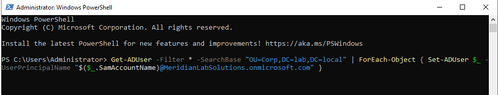

### proxyAddresses Attribute

Set the primary SMTP address for all users so Exchange Online knows what email address to assign when mailboxes provision:

```powershell
Get-ADUser -Filter * -SearchBase "OU=Corp,DC=lab,DC=local" | ForEach-Object {
    Set-ADUser $_ -Add @{proxyAddresses="SMTP:$($_.SamAccountName)@MeridianLabSolutions.onmicrosoft.com"}
}
```
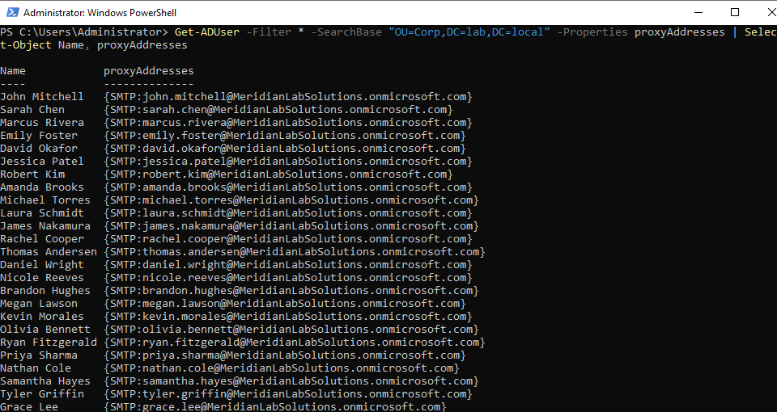

The uppercase `SMTP:` prefix designates the primary email address. Exchange Online uses this attribute to determine the user's email address during mailbox provisioning.

---

## Entra Connect Installation and Configuration

Installed Entra Connect Sync on DC01 (dedicated sync server is ideal in production, but DC01 works for a lab).

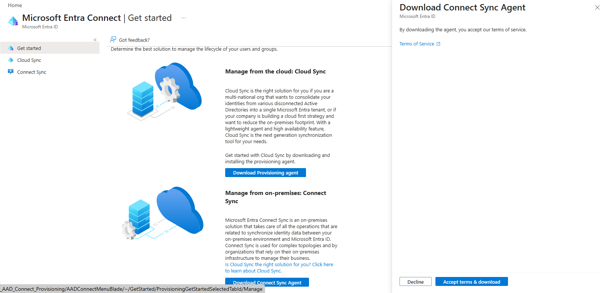

### Configuration Choices

**Sign-in method: Password Hash Synchronization (PHS)**
- A hash of the password hash syncs to Entra ID
- Users authenticate directly against the cloud
- Works even if on-prem goes down - M365 remains accessible
- Microsoft recommends PHS as a baseline because it enables leaked credential detection
- Chose PHS over Pass-Through Authentication (PTA, which requires on-prem DC to be reachable for every cloud login) and Federation (AD FS, complex infrastructure most companies are migrating away from)

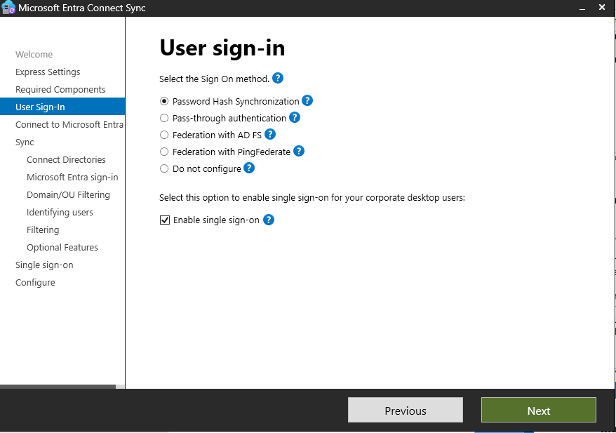

**Single Sign-On: Enabled**
- Domain-joined users access M365 apps without additional password prompts when already logged into their Windows session

**OU Filtering: Corp and sub-OUs only**
- Syncing: Departments (IT, HR, Finance, Sales, Engineering), Security Groups, Servers, Service Accounts, Workstations
- Excluded: Builtin, Computers, Disabled Accounts, Staging, Domain Controllers
- Mirrors production practice - never sync staging or disabled accounts to the cloud

**Optional Features Enabled:**
- Password Writeback - allows cloud password resets to write back to on-prem AD
- Password Hash Synchronization (default)

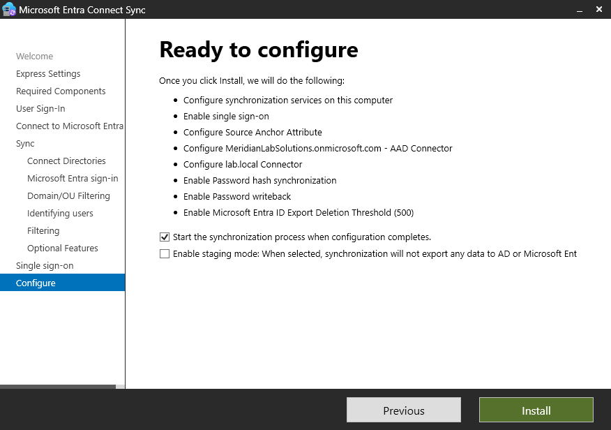
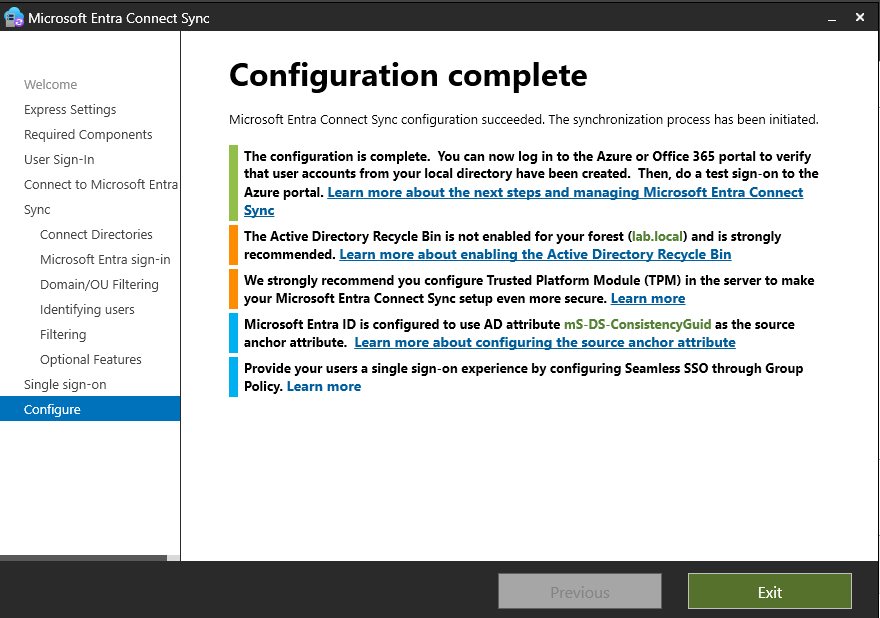
---

## Sync Verification

Initial sync completed in approximately 2 minutes. Verified in the Entra portal:

- All on-prem users appeared under Users > All Users with Source: "Windows Server AD"
- User attributes matched on-prem: display name, UPN, department, title
- All security groups synced correctly - department groups, role-based groups, all visible in Entra ID > Groups
- `Get-ADSyncScheduler` confirmed 30-minute automatic sync cycle active


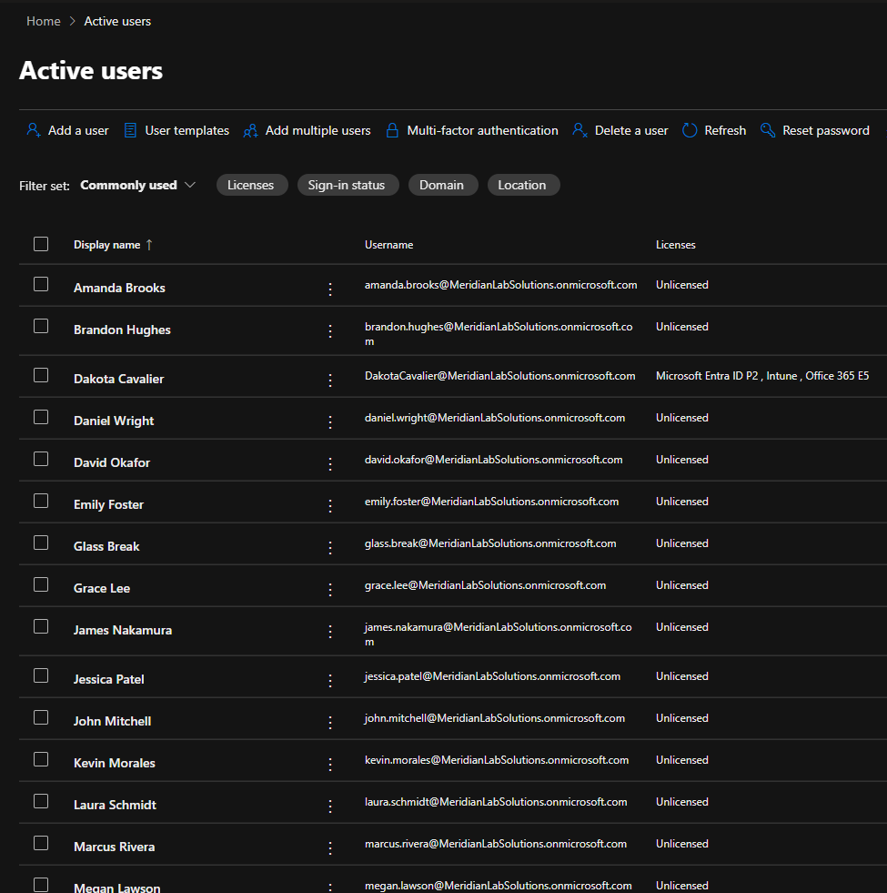

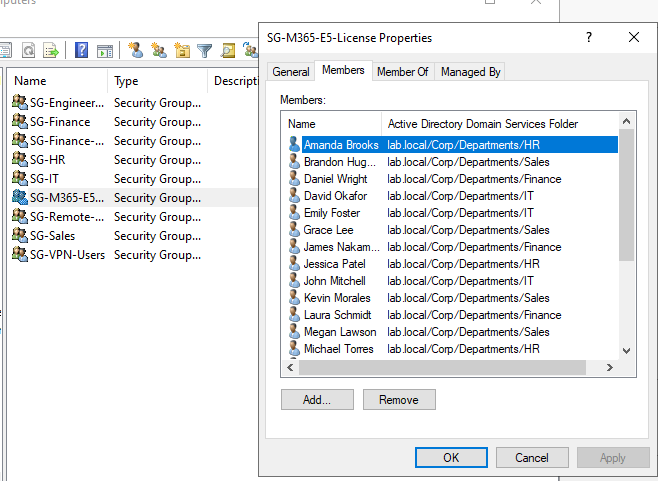

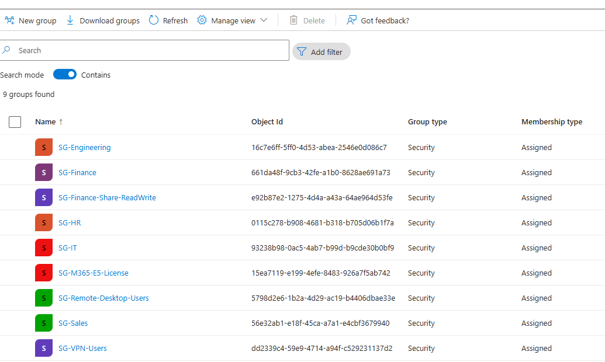


---

## Group-Based Licensing

### Setup

Created `SG-M365-E5-License` security group in on-prem AD (Security Groups OU). Added all department users across Engineering, Finance, HR, IT, and Sales using `-SearchScope Subtree` to recurse through all sub-OUs.

After delta sync, assigned Office 365 E5 licenses to the group in M365 admin center. All 21 group members automatically received licenses - no manual per-user assignment.

**Why this matters:** Group-based licensing is how real companies manage license assignment at scale. Adding a user to the license group in AD is the only step needed - the sync and license assignment happen automatically. When someone asks in an interview "how do you handle license management for hundreds of users," this is the answer.

Note: synced groups show "You can only manage this group in your on-premises environment" in M365 - confirming the source of truth is on-prem AD.

---

## End-to-End Onboarding Test

Created a new user (Michael Bigsfield, VP Sales) to test the complete pipeline:

1. Created AD account in Staging OU with correct UPN suffix
2. Set department, title, manager attributes
3. Moved to Sales OU
4. Added to SG-Sales and SG-M365-E5-License
5. Forced delta sync: `Start-ADSyncSyncCycle -PolicyType Delta`
6. User appeared in Entra ID within 2 minutes with correct attributes
7. E5 license auto-assigned through group membership
8. Exchange Online mailbox provisioned automatically
9. Logged into outlook.office.com successfully

Full onboarding from AD account creation to working email - without touching the cloud once.


---

## Breakage Exercises

### Sync Scheduler Disabled - Silent Failure

Disabled the automatic sync cycle:
```powershell
Set-ADSyncScheduler -SyncCycleEnabled $false
```

**Key discovery:** Manual delta syncs (`Start-ADSyncSyncCycle -PolicyType Delta`) still work even with the scheduler disabled. The real-world scenario isn't that sync completely stops - it's that the automatic 30-minute cycle dies silently, and nobody notices until changes stop propagating on their own. A new hire gets created at 9 AM, and at 9:45 someone asks why they're not in M365. Manual sync works, which makes it confusing - "it works when I force it but not automatically."

**Diagnosis:** `Get-ADSyncScheduler` shows `SyncCycleEnabled: False`. Fix: re-enable and force a catch-up sync.

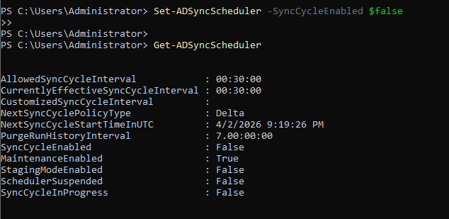

### UPN Changed Back to .local

Changed Michael's UPN back to `@lab.local` and synced. No sync errors appeared - Entra ID silently ignored the change because `.local` isn't a routable domain. The cloud identity retained the old `@MeridianLabSolutions.onmicrosoft.com` UPN.

**Lesson:** The identity doesn't break visibly, but it becomes mismatched between on-prem and cloud. This can cause subtle issues down the road - password sync may not apply correctly, attribute updates may stop flowing. The lack of a visible error makes this harder to catch than an outright failure.


### User Moved Outside Sync Scope

Moved Michael from the Sales OU to Disabled Accounts (outside the synced OU scope). Forced delta sync. Michael was immediately soft-deleted from Entra ID - mailbox, license, Teams access, everything gone.

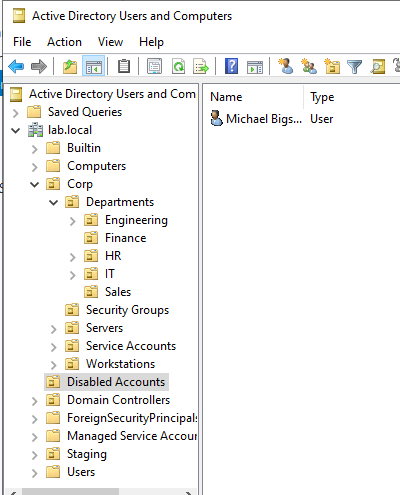

**Critical insight:** Attempted to restore from the cloud side while the user was still in the wrong OU - Entra blocked it because the UPN was already claimed by the synced identity. Restoring from the cloud side while the source of truth (AD) still has the user in the wrong place would create an orphaned cloud account and a sync conflict.

**Correct recovery:** Always fix from the source of truth. Moved Michael back to Sales OU in AD, forced delta sync, account restored in Entra ID with license and mailbox intact.

### The Password Reset Spiral

This was the most valuable troubleshooting experience of the entire phase.

**What happened:** Needed to log into outlook.office.com as Michael to test email. Reset his password from the M365 admin center (cloud-side reset). Got past the initial login screen but the "create new password / enter current password" prompt rejected the cloud-issued temp password.

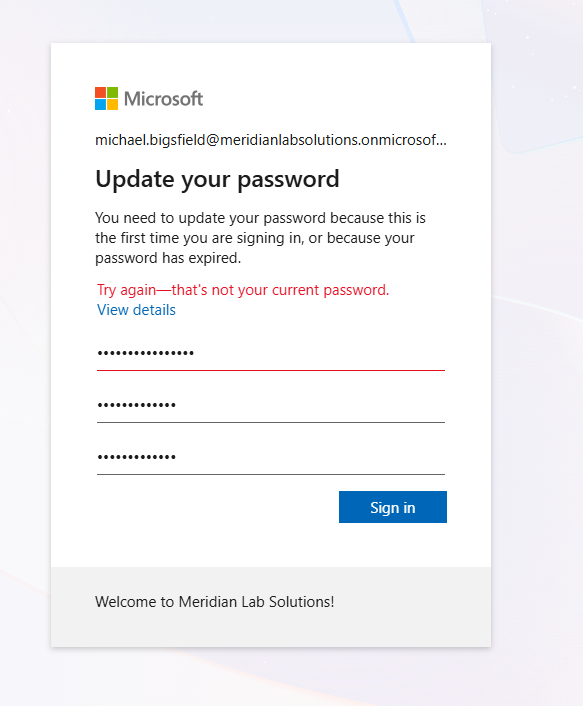

**Root cause:** The cloud reset wrote back to AD via password writeback, but the "User must change password at next logon" flag on the AD account created a conflict. The cloud temp password got through the first authentication screen, but the password change prompt was validating against the synced AD password hash - which was still the old password because the sync hadn't fully propagated the writeback.

**Attempted fixes:**
- Reset from AD via PowerShell, forced delta sync - still failed
- Reset from AD again, synced again - still failed
- Blocked sign-in in Entra, reset in AD, synced, unblocked - still failed
- Error 50126 in sign-in logs: invalid credentials

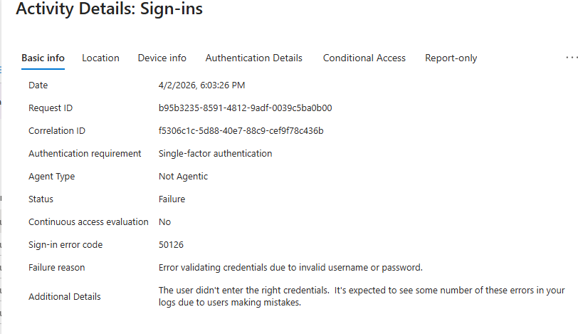

**Actual resolution:** The password hash sync needed several minutes beyond the delta sync completion to propagate on the authentication side. The AD-set password eventually worked after waiting longer. Confirmed by retesting before the cloud reset - the AD password was accepted.

**Lesson for desktop support:** In hybrid environments, password resets should start from on-prem AD, not the cloud. If the cloud reset doesn't work immediately, reset from AD and sync - that's the reliable path. And tell the user to wait 5 minutes before trying. Most "my new password doesn't work" tickets are just propagation timing, not a broken sync.

---
