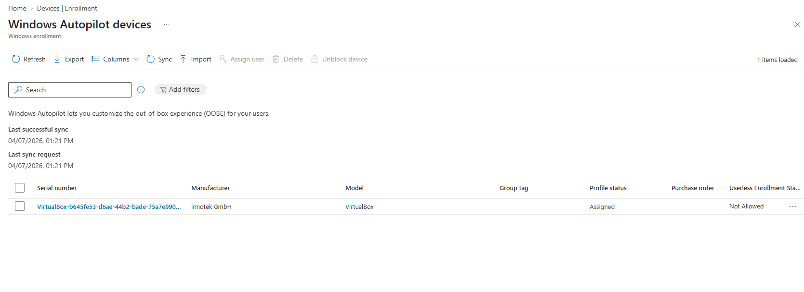
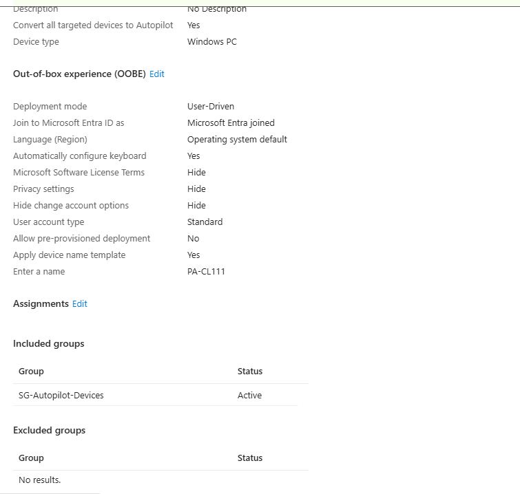
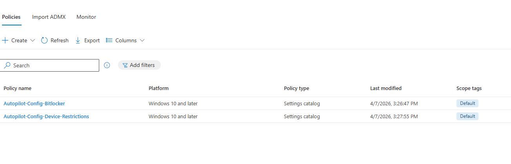
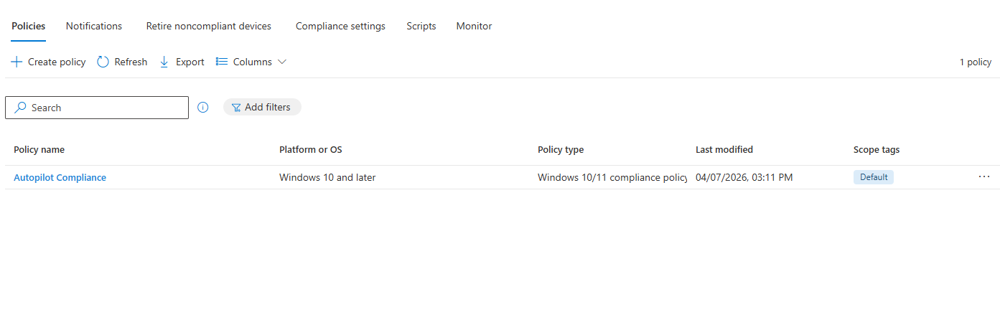
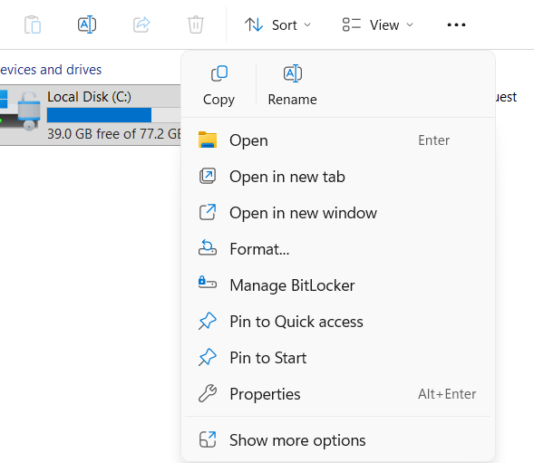
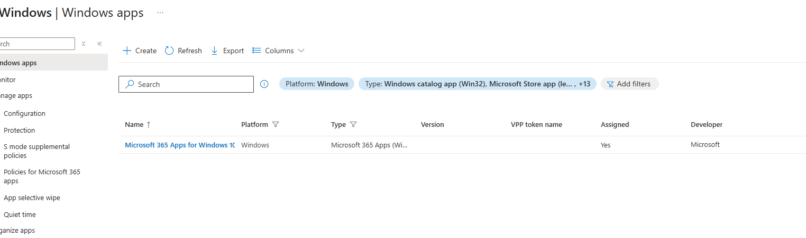
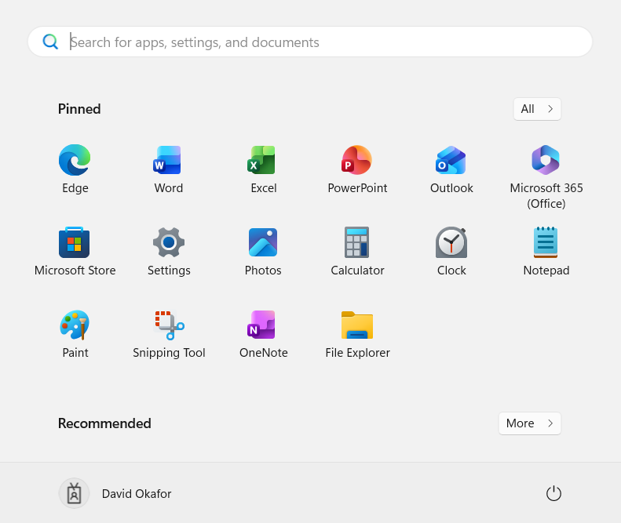
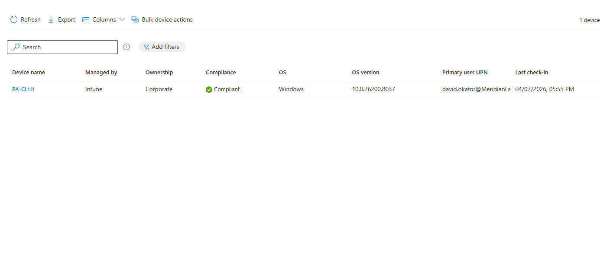

# Phase 7: Intune & Endpoint Management Deep Dive - Build Log

This phase connects everything: a user created in on-prem AD, synced to Entra ID, licensed through group-based licensing, enrolls a device through Autopilot, and receives compliance policies, configuration profiles, BitLocker encryption, and M365 Apps - all automatically without IT touching the device.

---

## Autopilot Re-Enrollment

### Device Preparation

Wiped the Autopilot device and re-enrolled it into the clean hybrid tenant. The hardware hash was still registered in Intune from the previous enrollment - hardware hashes are tied to physical hardware and survive wipes.

Created a dynamic device group `SG-Autopilot-Devices` in Entra ID with the rule:
```
(device.devicePhysicalIDs -any (_ -contains "[ZTDId]"))
```
This automatically captures any device registered in Autopilot - no manual group management needed when new devices are added.



Assigned the Autopilot deployment profile (`AutoPilotDemo`) to SG-Autopilot-Devices:
- Mode: User-Driven
- Join type: Entra ID joined
- Account type: Standard (not admin)
- OOBE screens: Hidden (privacy, EULA, etc.)
- Device naming template: PA-CL111



### Enrollment Result

Reset the device to OOBE. On boot, connected to Wi-Fi, Autopilot recognized the hardware hash, and the Enrollment Status Page appeared showing progress through device preparation, security policies, certificates, network connections, and app installation.

Signed in as david.okafor@MeridianLabSolutions.onmicrosoft.com (synced hybrid user with E5 license). After enrollment completed:

- **Outlook:** Auto-configured with David's Exchange Online mailbox - no manual profile setup
- **BitLocker:** Encrypting the C: drive with recovery key stored in Entra ID
- **M365 Apps:** Word, Excel, PowerPoint, Outlook all installed automatically
- **Compliance status:** Compliant in the Intune portal
- **Device record:** Shows in Intune as corporate-owned, managed by Intune, Entra ID joined



---

## Compliance Policy

Created a Windows compliance policy requiring:
- Minimum OS version (current build)
- BitLocker encryption required
- Windows Firewall required
- Real-time antivirus protection required

Assigned to SG-Autopilot-Devices. Device evaluated as Compliant immediately after enrollment since all requirements were met by the configuration profiles pushing the settings.



**How compliance connects to Conditional Access:** Compliance policies define "what does a healthy device look like." Conditional Access policies can then enforce "only healthy devices can access M365." A noncompliant device gets blocked from Outlook, Teams, SharePoint - everything. The user calls and says "I can't access anything," and you check Intune compliance status to find the specific policy that's failing.

---

## Configuration Profiles

### BitLocker Encryption

Created a configuration profile enforcing BitLocker device encryption with silent encryption enabled (no user prompt). After deployment, BitLocker activated on the device and the recovery key was automatically escrowed to Entra ID.

Recovery key verified at: Entra ID → Devices → PA-CL111 → Recovery Keys.




### Device Restrictions

Created a device restrictions profile through Templates. Tested blocking Control Panel access to simulate a corporate lockdown policy.

**Policy removal gotcha (experienced twice):** Deleted the restriction policy from Intune but the Control Panel block persisted on the device. Intune policy removal doesn't automatically undo applied settings - the device needs to sync and reprocess. Fixed by forcing a sync through Settings → Accounts → Access work or school → Sync.

---

## Application Deployment - M365 Apps

Deployed Microsoft 365 Apps (Outlook, Word, Excel, PowerPoint, Teams) as a required app through Intune, assigned to SG-Autopilot-Devices.

Configuration:
- Update channel: Current Channel
- Architecture: 64-bit
- Assignment: Required (auto-installs during enrollment)



Apps installed automatically during the Autopilot Enrollment Status Page phase. By the time the user reached the desktop, all applications were available in the Start menu and Outlook was auto-configured with the user's Exchange Online mailbox.




---

## The Complete Pipeline - End to End

This is what the entire lab has been building toward. Here's what happens when a new hire starts at Meridian Lab Solutions:

1. **IT creates AD account** in on-prem AD with correct UPN suffix, department, title
2. **Added to security groups** - SG-Engineering, SG-M365-E5-License
3. **Entra Connect syncs** the user to Entra ID within 30 minutes (or immediately with delta sync)
4. **Group-based licensing** auto-assigns E5 license
5. **Exchange Online** auto-provisions mailbox
6. **New laptop arrives** - hardware hash pre-registered by manufacturer or uploaded by IT
7. **User powers on laptop**, connects to Wi-Fi, signs in with Entra ID credentials
8. **Autopilot** recognizes the device, enrolls it in Intune
9. **Compliance policies** evaluate the device (BitLocker, firewall, antivirus)
10. **Configuration profiles** push security settings (BitLocker encryption, restrictions)
11. **M365 Apps** install automatically (Outlook, Word, Excel, Teams)
12. **Outlook auto-configures** with the user's mailbox
13. **User is working** within an hour - fully configured, fully secured, zero manual setup

Everything flows from the identity pipeline through the cloud.

---

