# Microsoft 365 - Build Log

Phase 2: M365 tenant setup, user and group management, Exchange Online, Entra ID with Conditional Access, and hybrid identity concepts. Built on a Microsoft 365 Business Premium trial tenant for the fictional company Meridian Lab Solutions.

---

## Tenant Setup

Microsoft's M365 Developer Program sandbox is effectively locked down since early 2024. Signed up for a Business Premium free trial instead - full tenant with 25 user licenses, admin account at DakotaCavalier@MeridianLabSolutions.onmicrosoft.com.

---

## Users and Licensing

Created users matching the on-prem AD structure across IT, HR, Finance, Sales, and Engineering.

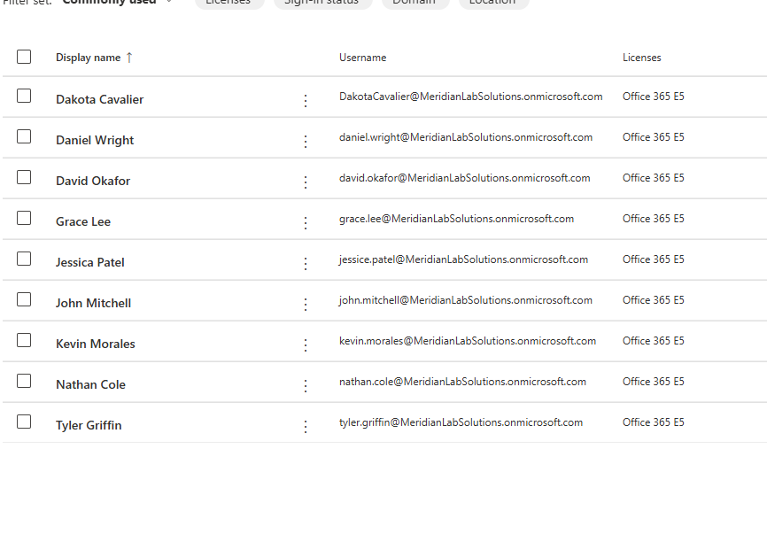

**Key difference from on-prem AD:** In Active Directory, the user account alone grants access to domain resources based on group membership. In M365, the account provides authentication only - the license unlocks services. An unlicensed user can sign in but has no mailbox, no Teams, no OneDrive. The E5 license is a bundle of service plans (Exchange, Teams, SharePoint, Intune, etc.) that can be individually toggled per user.

**Lesson learned:** Used auto-generated passwords during creation and clicked past the confirmation screen without copying them. Had to bulk-reset all users with a known temporary password and forced change at first login. In production, either set a known temp password upfront or have a process to capture auto-generated credentials.

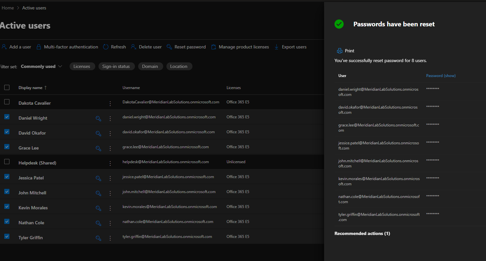

---

## Groups - Three Types Working Together

### Microsoft 365 Groups (via Teams)

Created department Teams (IT, HR, Finance, Sales, Engineering). Each automatically provisioned a Microsoft 365 Group with a shared mailbox, SharePoint site, and shared calendar.

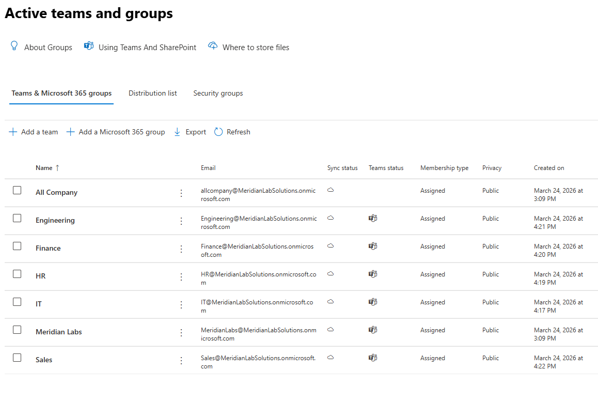

A Microsoft 365 Group is the foundation - membership, shared mailbox, SharePoint, calendar. A Team is the collaboration layer on top, adding chat channels and video meetings. Every Team has a Microsoft 365 Group underneath; you can have a Group without a Team but not a Team without a Group.

No on-prem equivalent exists. In AD, a security group is purely access control. A Microsoft 365 Group is access control plus automatically provisioned collaboration resources.

### Security Groups

Created SG-IT, SG-HR, SG-Finance, SG-Sales, SG-Engineering as pure access control containers - no mailbox, no SharePoint, no Teams. These mirror the AD security groups from Phase 1 and control policy/license assignment.

**The model:** Microsoft 365 Groups handle collaboration. Security Groups handle access control. Both are needed - someone in Finance joins the Finance Team for collaboration and SG-Finance for policy and license assignment.

---

## Exchange Online

### Shared Mailbox - helpdesk@

Created a shared mailbox for IT. Granted Full Access and Send As to IT department users.

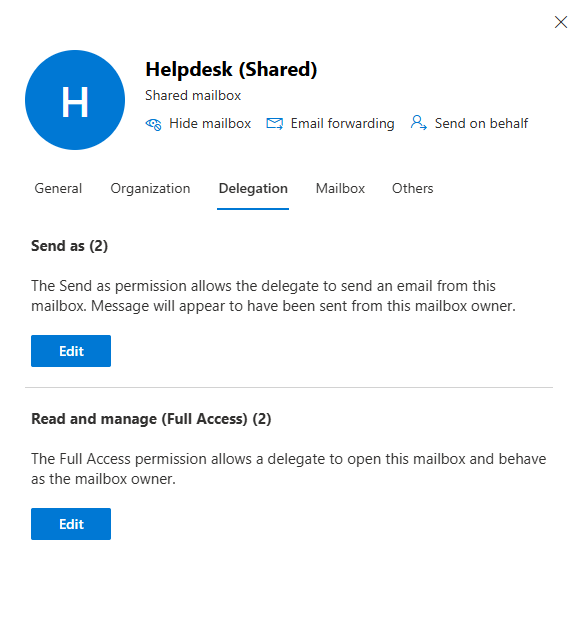

**Why not a shared password:** Every action through a shared mailbox is tied to the individual user's authenticated account, preserving the audit trail. Five people logging into the same account destroys accountability.

**Propagation delay:** Permissions took up to an hour to appear in Outlook. Common help desk scenario - user gets granted access, calls 10 minutes later saying it's broken. Usually resolves on its own.

### Mail Flow Rule - Confidentiality Disclaimer

Transport rule appending a confidentiality disclaimer to all outbound email to external recipients. Internal emails excluded - unnecessary noise.

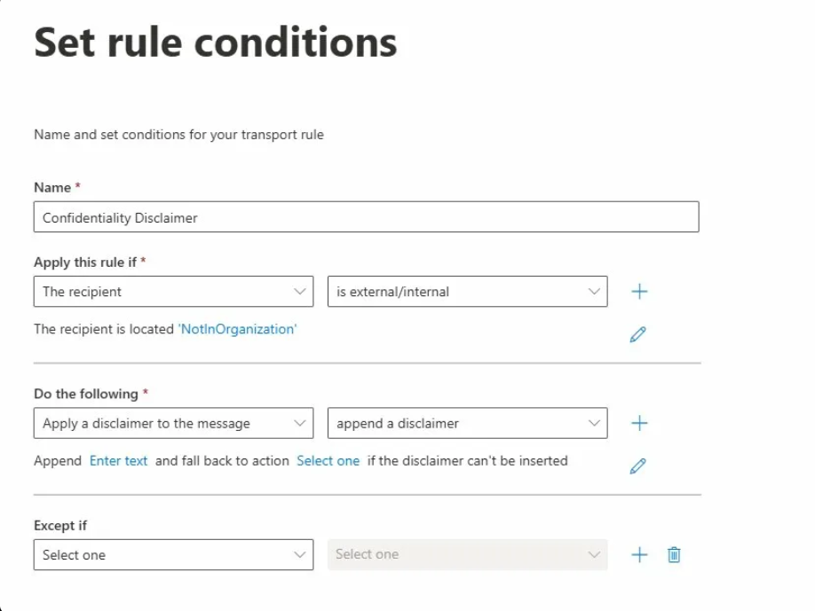

### Message Trace

Traced a test email between two users - status Delivered. Establishes the baseline for what a clean trace looks like. The real value is when emails don't arrive: trace shows delivered, dropped, quarantined, or failed, and why.

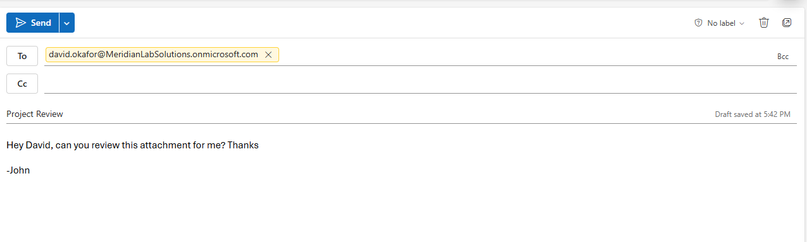

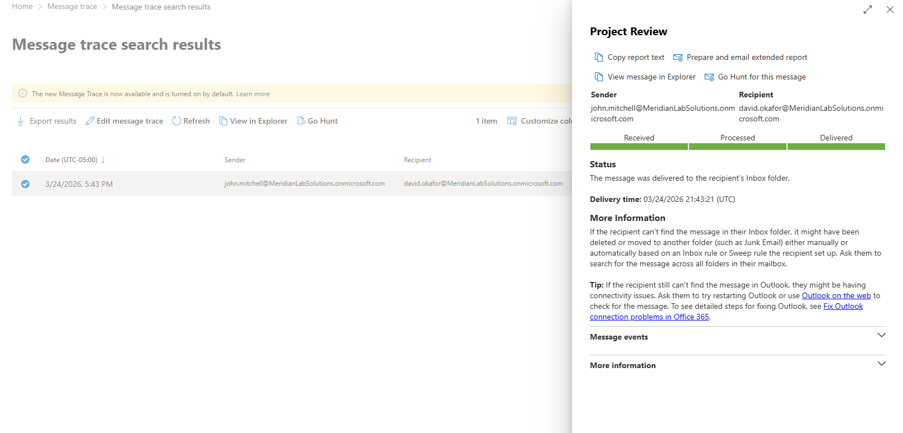

---

## Entra ID & Conditional Access

### Break-Glass Account

Created BreakGlass@MeridianLabSolutions.onmicrosoft.com - Global Admin, long complex password, no M365 license, excluded from every Conditional Access policy. Emergency access if CA policies lock out all admin accounts.

### Conditional Access Policies

**Require MFA for Admins** - Targets all admin directory roles. Requires multifactor authentication. Break-glass excluded.

**Block Legacy Authentication** - Blocks POP3, IMAP, basic SMTP connections that bypass MFA entirely by sending credentials in plain text.

**Require Compliant Device** - Report-only mode (Intune not configured). Would require device enrollment before M365 access in production.

**Named Locations** - Trusted office IP skips MFA; everywhere else gets challenged.
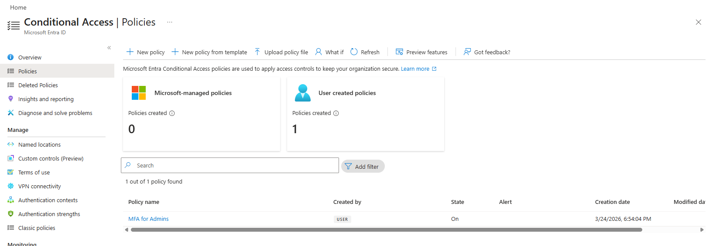
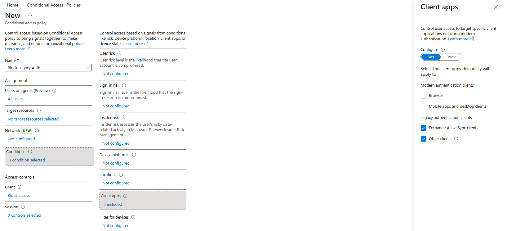
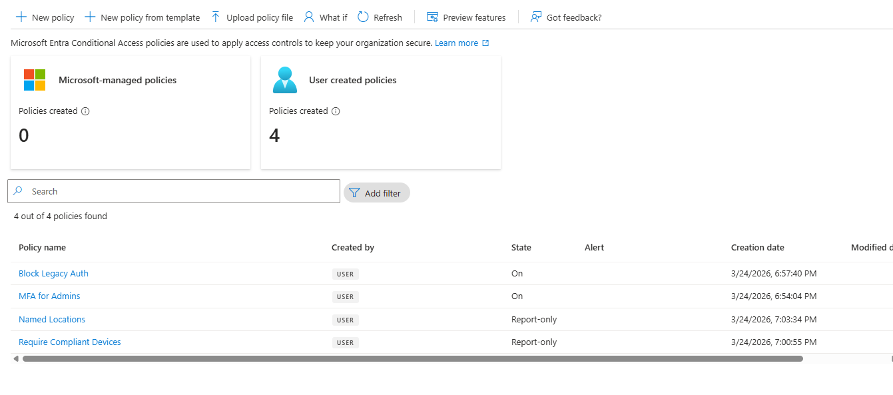

---

## Breakage Exercises

### License Removal

Removed john.mitchell's E5 license. Lost all M365 services - Outlook, Teams, OneDrive. Account still existed and could authenticate, but every service was locked. Microsoft retains mailbox data for 30 days (soft delete). Reassigning the license restores everything within that window.

### Blocked Sign-In - Investigation Before Fix

Blocked john.mitchell's sign-in. Before re-enabling, investigated through logs:

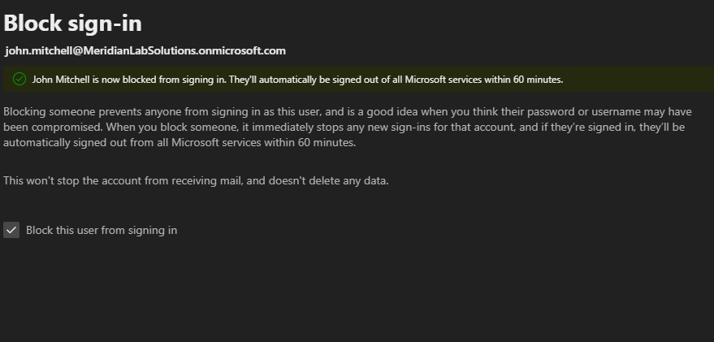

- **Sign-in logs:** 2 failed attempts - not enough for automatic lockout

- **Audit log:** Manual "UpdateUser" activity targeting the account - confirmed admin-initiated block, not brute force

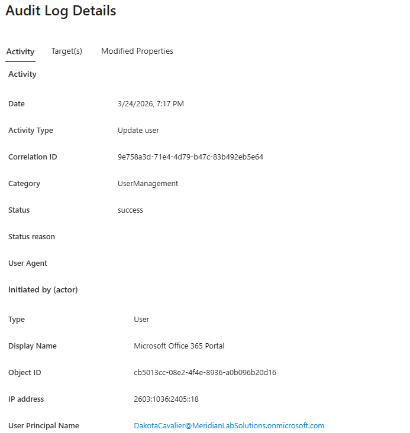
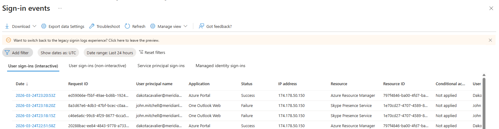

**Why this matters:** If auto-locked from repeated failures, could indicate an active attack. If manually disabled, someone did it deliberately - possibly a termination. Re-enabling without understanding why could reactivate a terminated employee's access. The investigation determines the response.

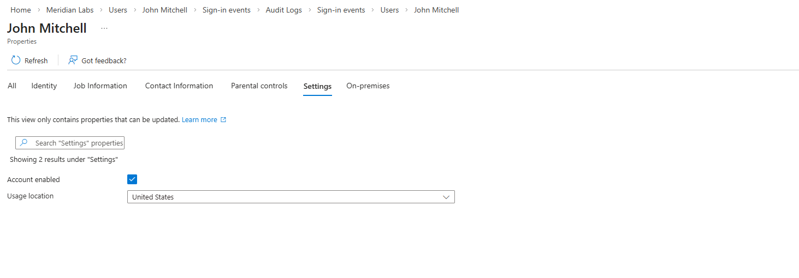

---

## Hybrid Identity Concepts

Entra Connect bridges on-prem AD and Entra ID. Runs on an on-prem server, syncs changes from AD to cloud every 30 minutes. One-directional: on-prem is source of truth.

**Termination timing gap:** Account disabled at 2:00 PM, last sync at 1:45 PM - employee retains full cloud access until 2:15 PM. For a disgruntled employee, that's a 30-minute window to exfiltrate data. Proper offboarding requires disabling the AD account AND blocking M365 sign-in AND revoking active sessions simultaneously.

**Sync server failure:**  If Entra Connect goes down, both environments keep working independently but drift apart. New AD users don't appear in M365, password changes don't propagate. Users authenticate with stale credentials - a security risk nobody notices until something breaks.