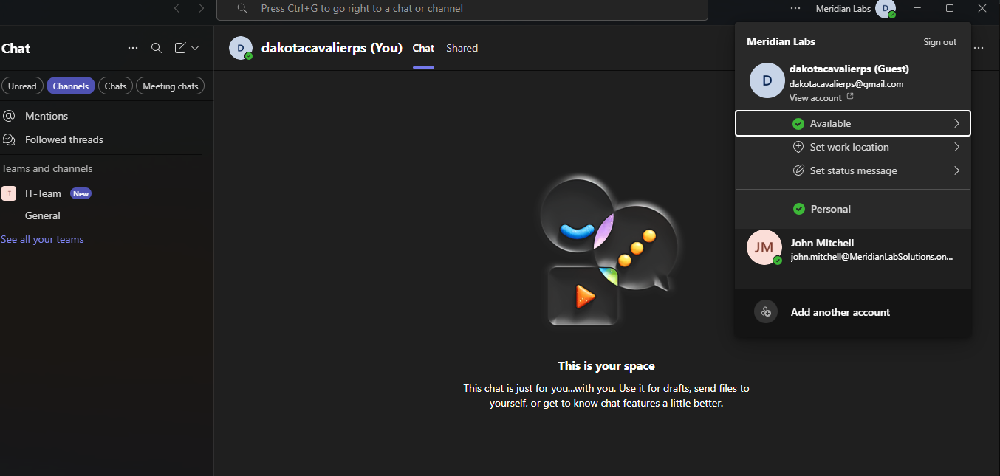
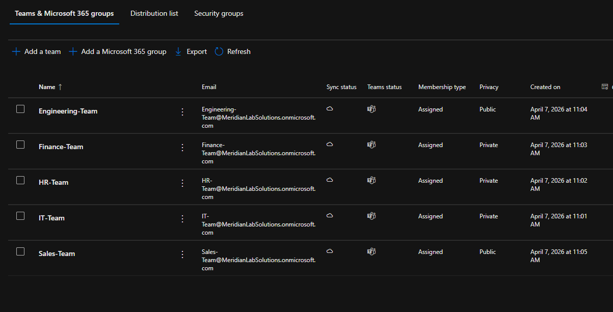
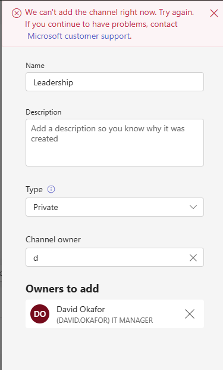
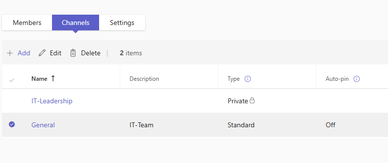
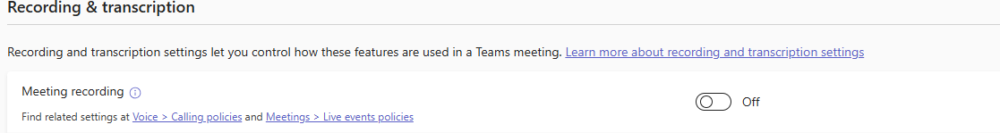
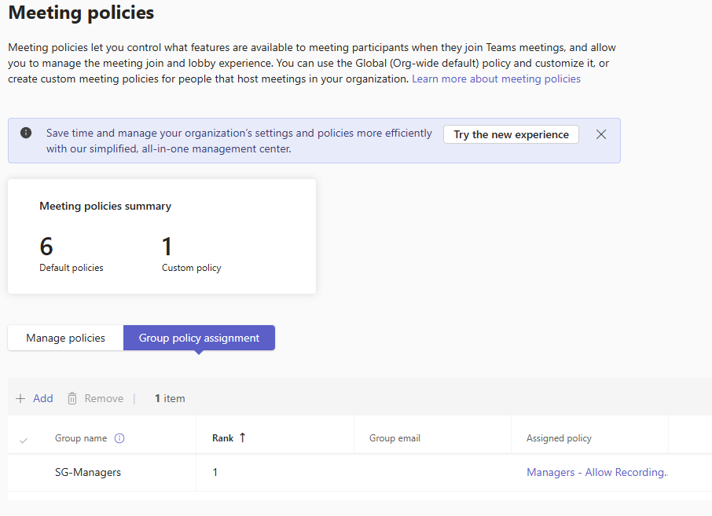
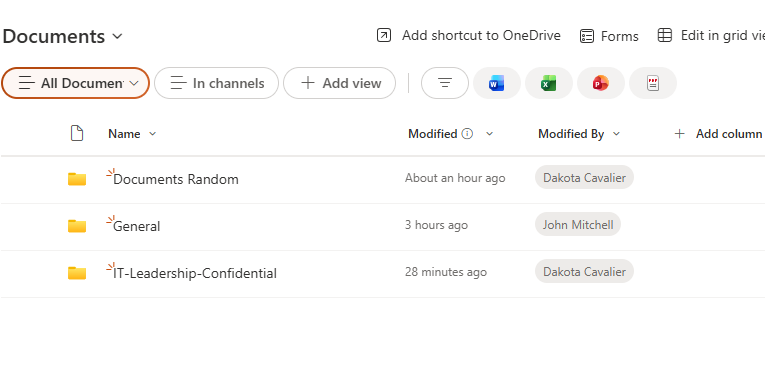
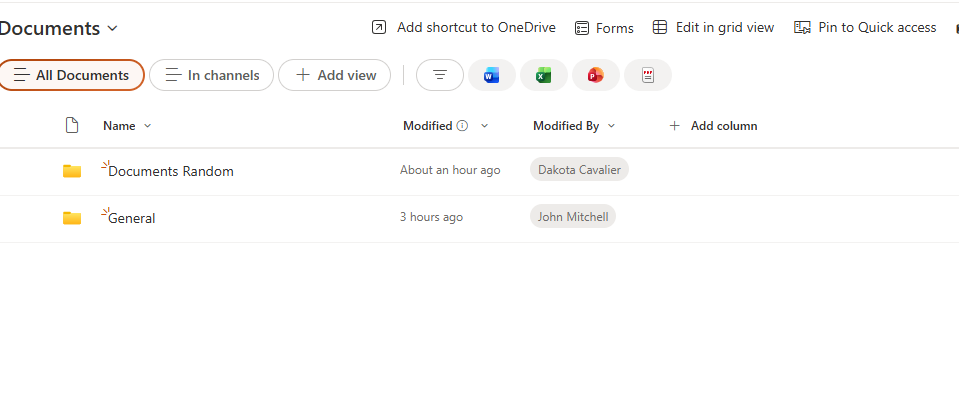
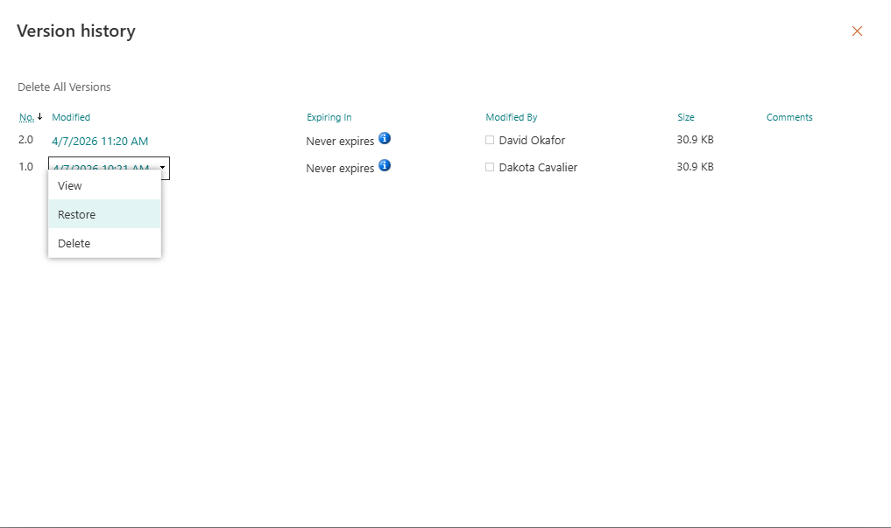

# Phase 6: Teams & SharePoint Online Administration - Build Log

Teams and SharePoint are tightly integrated - every Team auto-creates a SharePoint site behind it. Understanding this relationship is key to troubleshooting access issues that users report as "Teams problems" but are actually SharePoint permission problems.

---

## Teams Administration

### Org-Wide Settings

Reviewed external access (federation), guest access, and messaging policies in the Teams Admin Center.

- **External access (federation):** Controls whether users can chat/call with people at other organizations who also use Teams. Both parties stay in their own tenants - no guest invitations needed.
- **Guest access:** Inviting someone into your tenant. They show up with a "(Guest)" tag, can see channels, files, join meetings.
- **Messaging policies:** Controls what users can do in chat - edit messages, delete messages, use GIFs, priority notifications.

Enabled guest access and invited a personal Microsoft account as a guest to test the experience.

### Department Teams

Created Teams for each department with appropriate members. Each Team automatically provisioned a Microsoft 365 Group with shared mailbox, SharePoint site, and calendar underneath.

### Private Channels

Created an IT-Leadership private channel within the IT team. Hit an issue where the channel name "Leadership" was rejected - private channel names must be unique across the entire tenant, not just within the team. Renamed to "IT-Leadership" and it worked.

**Troubleshooting process:** Checked Teams policies (all fine), tried changing the owner to myself (didn't help), searched the issue and found the name conflict requirement. Resolved by using a unique name.

### Meeting Policies - RBAC for Recording

Configured meeting policies so recording is disabled for standard users but enabled for managers.

**Approach:** Made the Global (Org-wide default) policy restrictive - disabled cloud recording for everyone. Created a custom "Managers - Allow Recording" policy with recording enabled. Assigned the custom policy to SG-Managers (created in on-prem AD, synced to Entra ID) using group-based policy assignment with Rank 1 priority.

This follows the same RBAC pattern used everywhere else in the lab: restrictive by default, open up by group membership. New hires automatically get the restrictive policy without any manual assignment. Managers get the override through their security group.

**Policy conflict resolution in Teams:** Teams doesn't stack policies - each user gets exactly one. If a user is in multiple groups with different policies, the rank system determines which wins. Rank 1 beats Rank 2. This is different from Conditional Access (additive, most restrictive wins) and GPOs (LSDOU order, last applied wins).

### Teams Client Troubleshooting

**Cache clearing:** New Teams stores its cache at `%localappdata%\Packages\MSTeams_8wekyb3d8bbwe\LocalCache`. Clearing the cache (close Teams → delete contents of LocalCache → relaunch) fixes ~90% of "Teams is frozen/not loading/showing weird stuff" issues. Same concept as deleting the Outlook .ost file - local cache is just a copy, real data lives in the cloud.

**Isolation test:** If Teams desktop is broken, test teams.microsoft.com in a browser. If web works but desktop doesn't - client-side problem, clear cache or reinstall. If both broken - account or service-side problem, check licensing, sign-in logs, Service Health. Same logic as Outlook vs OWA.

---

## SharePoint Online

### Understanding SharePoint

SharePoint is a cloud-based file storage and collaboration platform - essentially a cloud replacement for on-prem file servers. Every Teams team has a SharePoint site behind it. Files uploaded to a Teams channel are actually stored in SharePoint. The Files tab in Teams is a SharePoint document library viewed through the Teams interface.

Users access SharePoint through Teams (most common - they don't even realize it's SharePoint), direct browser links, OneDrive sync to File Explorer, or links shared via email.

### Permission Inheritance and Broken Inheritance

**Default behavior:** Everything in a document library inherits permissions from the site. If the IT team's SharePoint site gives access to all IT members, every folder and file inside also gives access to all IT members.

**Breaking inheritance:** Created an "IT-Leadership-Confidential" folder and broke permission inheritance so only SG-Managers could access it. Removed the IT-Team Members group that inherited from the parent.

**Verification:**  Logged in as a regular IT user (David Okafor, not in SG-Managers) - the confidential folder was completely invisible. Logged in as a manager - full access. The folder doesn't even show up for unauthorized users, which is the correct behavior.

This is the most common SharePoint support ticket: "I can't access this folder." The answer is almost always a permissions issue - either the user isn't in the right group, or inheritance was broken somewhere unexpected.

### Document Versioning

Enabled versioning on a document library. Edited a document multiple times, then restored an older version through Version History. Restoring creates a new version (e.g., restoring v1.0 creates v3.0 that's a copy of v1.0) - the full history is always preserved and you can even undo a restore.

This is the answer when a user says "I accidentally saved over my file." No data loss, full recovery through version history.

---
